# Reprogramação Transcriptômica da Via de Lipídios e Aterosclerose no Hepatocarcinoma

Análise exploratória de **expressão diferencial** da via *Lipid and
Atherosclerosis* (KEGG `hsa05417`) entre **Hepatocarcinoma (LIHC, TCGA)** e
**fígado normal (GTEx)**, com controle de qualidade pré-análise, rede de
interação proteína-proteína (STRING), **GSEA e GSVA (primeiros procedimentos)**,
enriquecimento funcional ORA (complementar) e geração automática de relatórios
de auditoria.

---

## Sumário

1. [Visão geral](#1-visão-geral)
2. [Fluxograma do pipeline](#2-fluxograma-do-pipeline)
3. [Desenho do estudo](#3-desenho-do-estudo)
4. [Resumo executivo](#4-resumo-executivo)
5. [Estrutura do repositório](#5-estrutura-do-repositório)
6. [Pré-requisitos e execução](#6-pré-requisitos-e-execução)
7. [Resultados](#7-resultados)
8. [Diagramas e esquemas](#8-diagramas-e-esquemas)
9. [Documentação / auditoria](#9-documentação--auditoria)
10. [Declaração de uso de IA](#10-declaração-de-uso-de-inteligência-artificial)
11. [Limitações](#11-limitações)
12. [Licença](#12-licença)

---

## 1. Visão geral

| Item | Descrição |
|------|-----------|
| **Desenho** | LIHC (TCGA) *vs.* Normal (GTEx Liver) |
| **Via analisada** | KEGG `hsa05417` — Lipid and Atherosclerosis |
| **Fonte de dados** | UCSC Xena (RNA-seq, escala log2) |
| **Método de DE** | `limma` direto (dados em log2) |
| **Critérios de significância** | FDR < 0,05 e \|log2FC\| > 1 |
| **Rede PPI** | STRING v12.0 (interações físicas, score ≥ 700) |
| **GSEA** | Enriquecimento por ranking (`gseKEGG`/`fgsea`) — primeiro procedimento |
| **GSVA** | Escore de enriquecimento por amostra (Hallmark + via) — primeiro procedimento |
| **ORA** | Super-representação (`enrichKEGG`/`enrichGO`) — análise complementar |

---

## 2. Fluxograma do pipeline

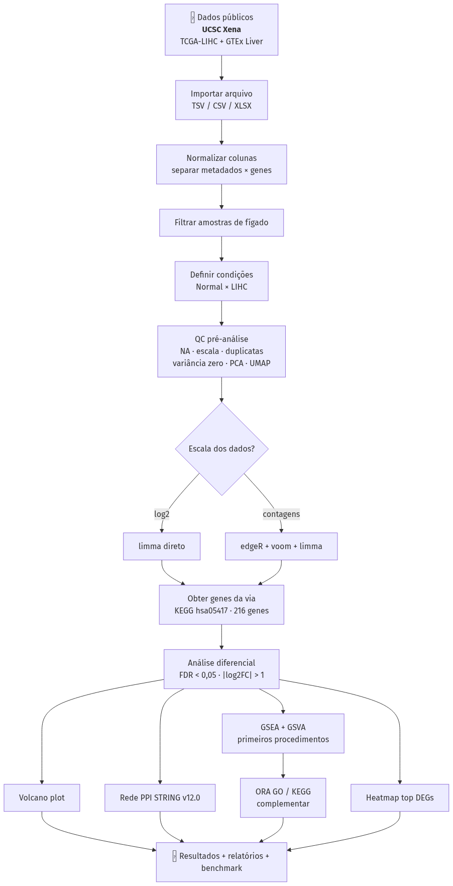

O pipeline é **portátil, reprodutível e autodocumentado** (`pipeline_hepato.R`):
detecta a raiz do projeto, localiza os dados, decide automaticamente entre
`limma` direto ou `edgeR + voom + limma`, e gera todos os resultados + logs +
benchmark.

---

## 3. Desenho do estudo

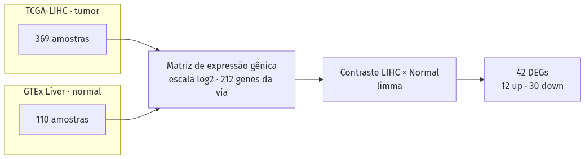

Duas coortes públicas foram combinadas a partir do UCSC Xena e restritas à via
`hsa05417` (216 genes; 212 presentes na matriz de expressão).

---

## 4. Resumo executivo

### 4.1 Amostras

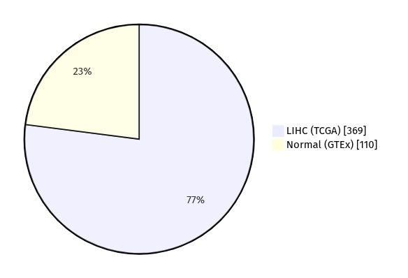

| Métrica | Valor |
|---------|-------|
| Amostras de fígado | **479** (LIHC: 369 · Normal: 110) |
| Genes da via KEGG `hsa05417` | 216 |
| Genes da via presentes na matriz | 212 |
| Escala dos dados | log2 (limma direto) |
| Tempo de execução | ≈ 462 s |

### 4.2 Genes diferencialmente expressos (DEGs)

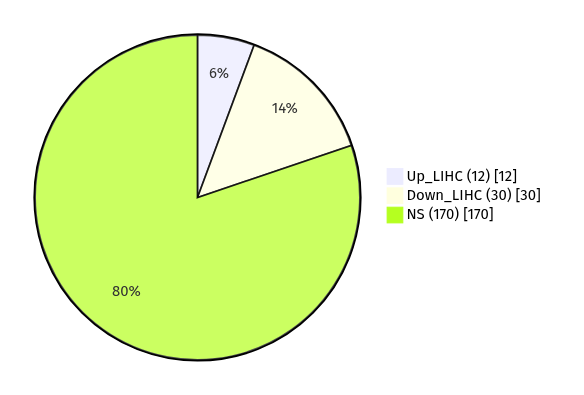

| Classe | Contagem |
|--------|----------|
| Up-regulados em LIHC | 12 |
| Down-regulados em LIHC | 30 |
| Não significativos (NS) | 170 |
| **Total de DEGs** | **42** |

---

## 5. Estrutura do repositório

```
.
├── pipeline_hepato.R                 # Pipeline principal (reprodutível)
├── scripts/
│   ├── análise_expressão_diferencial.R    # Versão original (legado)
│   └── analise_enriquecimento_gsea.R      # ORA + GSEA (a partir dos DEGs)
├── data/
│   └── README.md                     # Instruções para obter os dados de entrada
├── docs/
│   └── diagramas/                    # Fluxogramas e esquemas (Mermaid + PNG)
├── results/
│   ├── audit/                        # Relatórios, logs, benchmark e sessionInfo
│   ├── deg/                          # DEGs (CSV)
│   ├── enrichment/                   # GO/KEGG (ORA), GSEA e GSVA (CSV + figuras)
│   ├── figures/                      # Heatmap dos top DEGs (PNG)
│   ├── ppi/                          # Rede STRING e métricas topológicas
│   ├── qc/                           # PCA, UMAP e sumário de QC pré-análise
│   ├── tables/                       # Genes da via hsa05417
│   └── volcano/                      # Volcano plot da via (PNG/PDF)
├── .gitignore
└── LICENSE
```

---

## 6. Pré-requisitos e execução

R ≥ 4.0 e os pacotes:

```
dplyr, tidyr, tibble, stringr, ggplot2, ggrepel, limma, edgeR, igraph,
ggraph, pheatmap, scales, clusterProfiler, org.Hs.eg.db, KEGGREST,
STRINGdb, readr, readxl, rio, uwot, fgsea, msigdbr, GSVA
```

O script instala automaticamente qualquer pacote ausente (CRAN/Bioconductor).

**Execução:**

```bash
# 1) Baixe os dados (veja data/README.md) e salve como data/liver_lip_aterosclerose.tsv
# 2) Rode o pipeline completo
Rscript pipeline_hepato.R
```

---

## 7. Resultados

### 7.1 Controle de qualidade pré-análise (QC)

| Verificação | Resultado |
|-------------|-----------|
| Amostras de fígado | 479 (LIHC: 369 · Normal: 110) |
| Genes na matriz | 212 |
| Valores ausentes (NA) | 0 (0,00%) |
| Genes com variância zero | 0 |
| Genes/amostras duplicadas | 0 |
| Escala dos dados | log2 (range 0,00–21,37) |
| Efeito batch (TCGA/GTEx) | 2 estudos identificados |
| Decisão metodológica | limma direto (dados log2) |

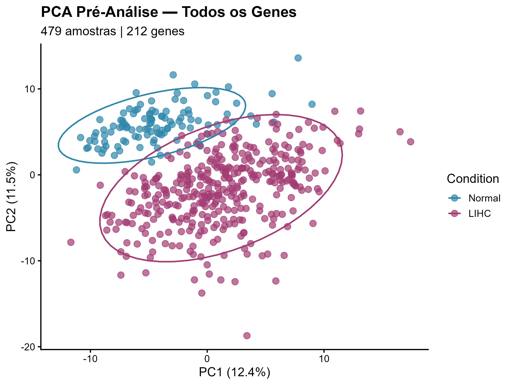

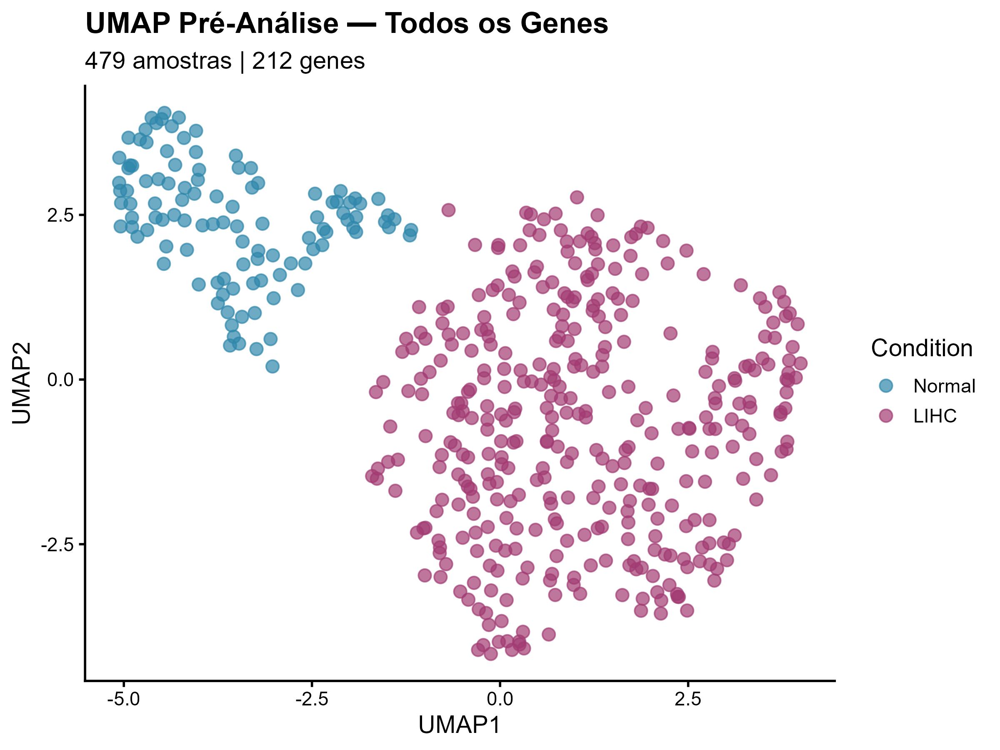

### 7.2 Análise de expressão diferencial (limma)

Contraste `LIHC − Normal`, com `limma` + `eBayes` (robusto) e correção de
Benjamini–Hochberg (FDR). Foram identificados **42 DEGs** na via `hsa05417`.

**Genes up-regulados em LIHC (12):**

| Gene | log2FC | FDR |
|------|-------:|----:|
| BAX | +1,28 | 4,5×10⁻⁴⁹ |
| HSP90AB1 | +1,12 | 7,5×10⁻⁴⁰ |
| PYCARD | +1,63 | 7,0×10⁻²² |
| PPARG | +1,07 | 2,3×10⁻²⁰ |
| MMP1 | +2,36 | 4,9×10⁻¹⁸ |
| LY96 | +1,64 | 9,3×10⁻¹⁸ |
| MMP9 | +1,91 | 4,0×10⁻¹⁴ |
| ABCG1 | +1,10 | 5,8×10⁻¹⁴ |
| CD36 | +1,34 | 6,1×10⁻¹³ |
| IKBKE | +1,12 | 1,9×10⁻¹² |
| VCAM1 | +1,37 | 6,5×10⁻¹¹ |
| PIK3R2 | +1,40 | 4,7×10⁻⁷ |

**Genes down-regulados em LIHC (30):**

| Gene | log2FC | FDR |
|------|-------:|----:|
| CALML5 | −3,08 | 3,2×10⁻⁸³ |
| MIB2 | −1,33 | 1,5×10⁻⁵⁷ |
| CXCL2 | −3,61 | 4,6×10⁻⁵⁶ |
| CALML6 | −2,82 | 1,7×10⁻⁵² |
| IKBKB | −1,08 | 5,3×10⁻⁵¹ |
| TNFRSF10B | −1,32 | 2,6×10⁻⁴⁹ |
| STAT3 | −1,11 | 4,9×10⁻³⁹ |
| ABCA1 | −1,28 | 1,3×10⁻³⁶ |
| CAMK2B | −3,69 | 4,0×10⁻³⁴ |
| PLCB2 | −1,38 | 7,7×10⁻²⁸ |
| SELE | −2,55 | 1,3×10⁻²⁷ |
| CALML3 | −2,53 | 3,9×10⁻²⁵ |
| IRF7 | −1,22 | 2,5×10⁻²² |
| FOS | −2,00 | 1,2×10⁻²¹ |
| TLR2 | −1,72 | 1,7×10⁻²¹ |
| CYP2C8 | −2,67 | 3,9×10⁻¹⁸ |
| CYP2B6 | −2,23 | 5,7×10⁻¹⁵ |
| CXCL3 | −1,58 | 1,2×10⁻¹³ |
| CYP2A7 | −3,31 | 4,4×10⁻¹³ |
| APOA4 | −3,27 | 1,0×10⁻¹² |
| CYP2C9 | −2,01 | 2,0×10⁻¹² |
| HSPA1B | −1,27 | 1,5×10⁻¹¹ |
| HSPA6 | −1,40 | 1,6×10⁻¹¹ |
| MAPK10 | −1,23 | 4,0×10⁻¹¹ |
| MAP3K5 | −1,03 | 1,0×10⁻⁹ |
| SELP | −1,18 | 5,9×10⁻⁹ |
| LBP | −1,11 | 9,0×10⁻⁷ |
| CYP2A6 | −2,17 | 1,9×10⁻⁶ |
| CAMK2A | −1,10 | 4,8×10⁻⁶ |
| CYP1A1 | −1,82 | 6,0×10⁻⁶ |

> Tabela completa (com t, P.Value, AveExpr e B): [`results/deg/DEG_significant_LA.csv`](results/deg/DEG_significant_LA.csv)
> e [`results/deg/DEG_LA_pathway_only.csv`](results/deg/DEG_LA_pathway_only.csv).

### 7.3 Volcano plot

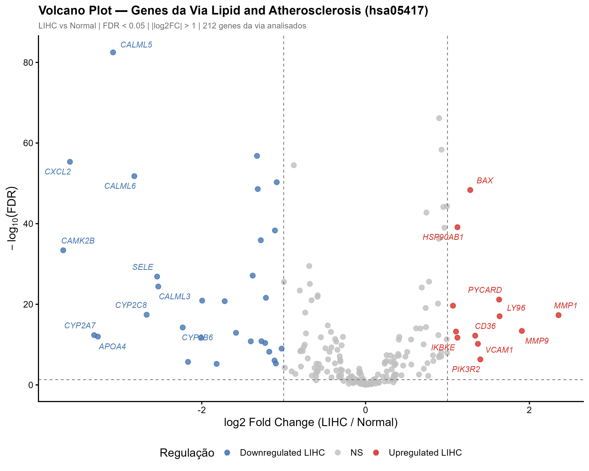

O volcano plot foca exclusivamente nos **212 genes da via `hsa05417`** e rotula
os 10 genes mais significativos de cada direção. Limiares: FDR < 0,05 e
|log2FC| > 1 (linhas tracejadas). Versão vetorial em
[`Volcano_LIHC_LA_pathway.pdf`](results/volcano/Volcano_LIHC_LA_pathway.pdf).

### 7.4 Rede de interação proteína-proteína (PPI — STRING v12.0)

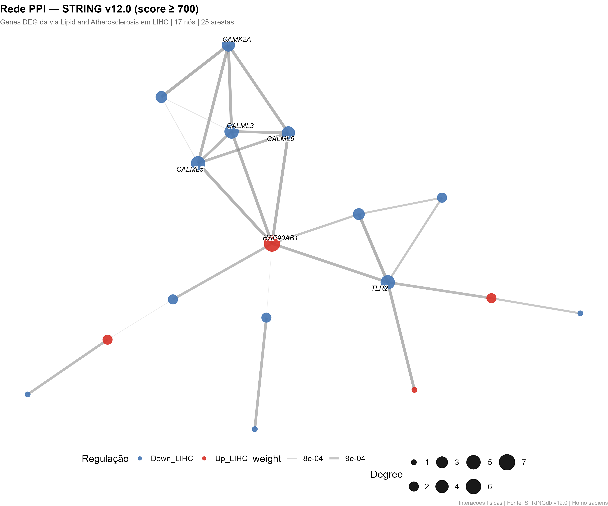

Interações físicas com score ≥ 700, construídas a partir dos 42 DEGs da via.

| Métrica | Valor |
|---------|-------|
| Genes de entrada | 42 |
| Genes mapeados no STRING | 41 |
| Interações (score ≥ 700) | 62 |
| Nós na rede | 27 |
| Arestas (após simplificação) | 31 |
| Componentes conexos | 5 |
| Maior componente | 17 nós |
| **Hubs (top 20% degree)** | **6** |

**Hubs identificados:** HSP90AB1 (grau 7), TLR2 (5), CALML3 (5), CALML5 (5),
CALML6 (4) e CAMK2A (4).

### 7.5 GSEA (enriquecimento por ranking) — primeiro procedimento

GSEA com os **212 genes ordenados por logFC** (rank-based).

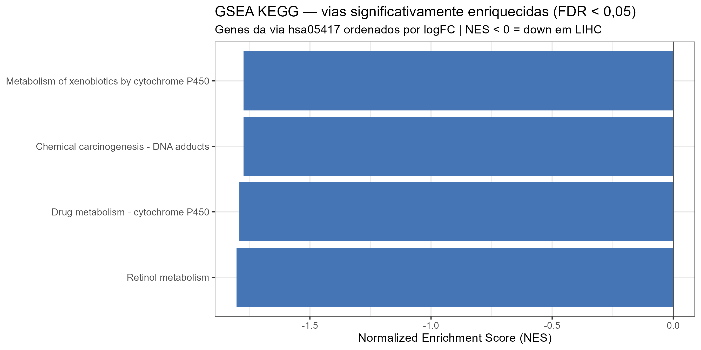

**GSEA KEGG** — 4 vias significativamente enriquecidas (FDR < 0,05), todas com
NES negativo (down-reguladas em LIHC):

| Via | NES | FDR |
|-----|----:|----:|
| Retinol metabolism | −1,80 | 4,3×10⁻³ |
| Drug metabolism — cytochrome P450 | −1,79 | 7,9×10⁻³ |
| Metabolism of xenobiotics by cytochrome P450 | −1,77 | 1,1×10⁻² |
| Chemical carcinogenesis — DNA adducts | −1,77 | 1,1×10⁻² |

**GSEA GO (BP)** — 7 termos significativos, incluindo *long-chain fatty acid
metabolic process*, *xenobiotic metabolic process*, *epoxygenase P450 pathway*
(NES < 0, down) e *phagocytosis* / *Wnt signaling pathway* (NES > 0, up).

**GSEA Hallmark (MSigDB)** — nenhum conjunto alcançou FDR < 0,05
(21 conjuntos testados).

> Arquivos: [`GSEA_KEGG.csv`](results/enrichment/GSEA_KEGG.csv),
> [`GSEA_GO_BP.csv`](results/enrichment/GSEA_GO_BP.csv),
> [`GSEA_HALLMARK.csv`](results/enrichment/GSEA_HALLMARK.csv).

### 7.6 GSVA (enriquecimento por amostra) — primeiro procedimento

O GSVA está **implementado no pipeline** (`pipeline_hepato.R`, seção 15) e
calcula escores de enriquecimento por amostra para os conjuntos Hallmark e para
a própria via `hsa05417`, comparando LIHC × Normal (teste t + FDR).

> Os escores GSVA exigem a matriz de expressão (arquivo de dados) e, portanto,
> são gerados na re-execução do pipeline. Saídas: `GSVA_scores.csv` e
> `GSVA_summary.csv` em [`results/enrichment/`](results/enrichment/).

### 7.7 Enriquecimento funcional — ORA (GO/KEGG) — análise complementar

Análise de super-representação (ORA) via `clusterProfiler`, com **background do
genoma completo**, separada por genes up e down.

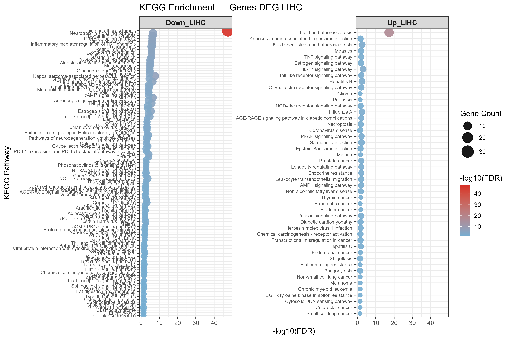

**Genes up-regulados** — processos mais enriquecidos:

| Fonte | Termo | FDR |
|-------|-------|-----|
| GO BP | regulation of lipid storage | 1,1×10⁻⁴ |
| GO BP | cholesterol storage | 2,9×10⁻⁴ |
| GO BP | response to lipopolysaccharide | 4,8×10⁻⁴ |
| GO BP | regulation of macrophage derived foam cell differentiation | 6,8×10⁻⁴ |
| KEGG | Lipid and atherosclerosis (hsa05417) | 5,5×10⁻¹⁸ |
| KEGG | IL-17 signaling pathway | 7,6×10⁻⁴ |
| KEGG | Fluid shear stress and atherosclerosis | 2,6×10⁻³ |
| KEGG | PPAR signaling pathway | 6,4×10⁻³ |

**Genes down-regulados** — processos mais enriquecidos:

| Fonte | Termo | FDR |
|-------|-------|-----|
| GO BP | epoxygenase P450 pathway | 1,0×10⁻⁹ |
| GO BP | arachidonate metabolic process | 1,3×10⁻⁶ |
| GO BP | xenobiotic catabolic process | 2,0×10⁻⁶ |
| GO BP | long-chain fatty acid metabolic process | 2,2×10⁻⁵ |
| KEGG | Lipid and atherosclerosis (hsa05417) | 2,9×10⁻⁴⁸ |
| KEGG | Kaposi sarcoma-associated herpesvirus infection | 4,4×10⁻⁸ |
| KEGG | Neurotrophin signaling pathway | 3,0×10⁻⁷ |
| KEGG | Fluid shear stress and atherosclerosis | 5,7×10⁻⁷ |

> Arquivos completos: [`GO_BP_up.csv`](results/enrichment/GO_BP_up.csv),
> [`GO_BP_down.csv`](results/enrichment/GO_BP_down.csv),
> [`KEGG_up.csv`](results/enrichment/KEGG_up.csv),
> [`KEGG_down.csv`](results/enrichment/KEGG_down.csv).

### 7.8 Heatmap dos top DEGs

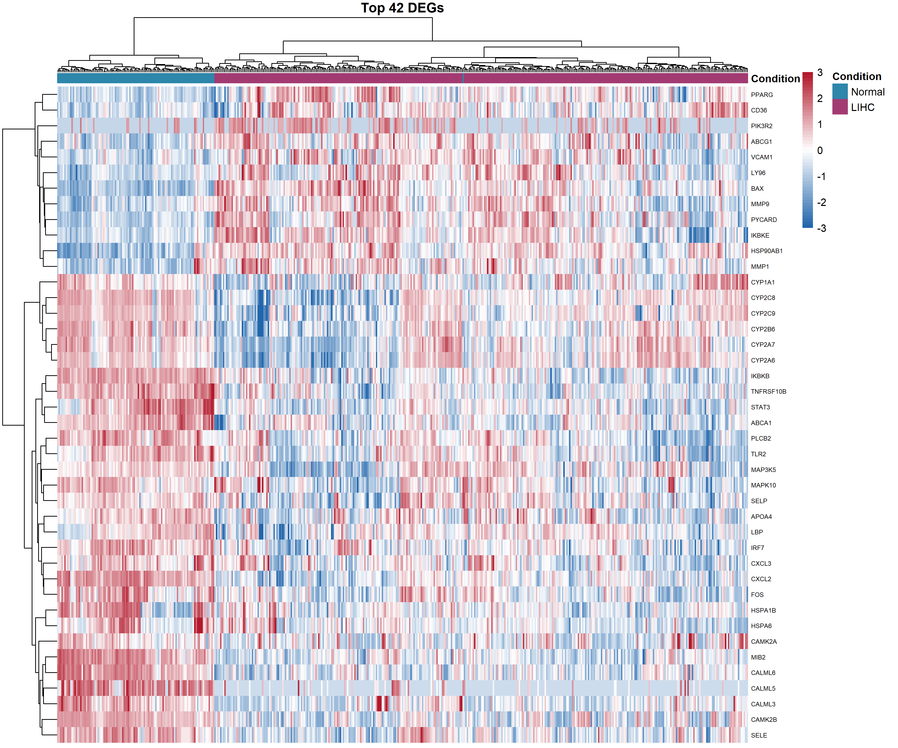

Top 42 DEGs, escala por linha (clamping ±3), clusterização ward.D2, com
anotação de condição (Normal × LIHC).

---

## 8. Diagramas e esquemas

Todos os diagramas estão em [`docs/diagramas/`](docs/diagramas/) em dois
formatos (Mermaid `.mmd` editável e PNG):

| # | Diagrama | Mermaid | PNG |
|---|----------|:-------:|:---:|
| 1 | Fluxograma do pipeline | [`.mmd`](docs/diagramas/01_fluxograma_pipeline.mmd) | [`.png`](docs/diagramas/01_fluxograma_pipeline.png) |
| 2 | Desenho do estudo | [`.mmd`](docs/diagramas/02_desenho_estudo.mmd) | [`.png`](docs/diagramas/02_desenho_estudo.png) |
| 3 | Metodologia / classificação DEG | [`.mmd`](docs/diagramas/03_metodologia_degs.mmd) | [`.png`](docs/diagramas/03_metodologia_degs.png) |
| 4 | Contexto biológico da via | [`.mmd`](docs/diagramas/04_contexto_biologico.mmd) | [`.png`](docs/diagramas/04_contexto_biologico.png) |
| 5 | Amostras (pizza) | [`.mmd`](docs/diagramas/05_amostras_pie.mmd) | [`.png`](docs/diagramas/05_amostras_pie.png) |
| 6 | DEGs (pizza) | [`.mmd`](docs/diagramas/06_degs_pie.mmd) | [`.png`](docs/diagramas/06_degs_pie.png) |

### Contexto biológico da via `hsa05417`

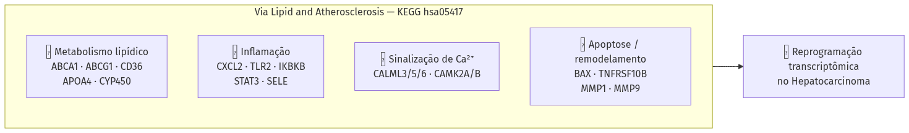

---

## 9. Documentação / auditoria

Relatórios em [`results/audit/`](results/audit/):

- `RELATORIO_FINAL_LOCK_LIHC.md` — veredito final e resultados consolidados
- `AUDITORIA_CODIGO_LINHA_A_LINHA.md` — auditoria do código
- `AUDITORIA_REANALISE_LIHC.md` — auditoria da reanálise
- `AUDITORIA_RESUMO_EXPANDIDO.md` — cruzamento do resumo com código/dados
- `pipeline_log.csv` — log passo a passo
- `benchmark_pipeline.csv` / `benchmark_summary.md` — métricas de execução
- `sessionInfo.txt` — ambiente R completo

---

## 10. Declaração de uso de inteligência artificial

> *Portaria CNPq nº 2.664/2026* — Este trabalho contou com o uso de ferramentas
> de inteligência artificial generativa (ChatGPT-5.5, OpenAI; DeepSeek-V4-Pro,
> DeepSeek) como suporte para processamento de dados transcriptômicos, revisão
> de código em linguagem R e editoração científica, sob supervisão e validação
> integral dos autores, que assumem total responsabilidade pelo conteúdo final.

---

## 11. Limitações

- Estudo exploratório com dados secundários (TCGA/GTEx);
- Sem validação em coorte independente;
- Sem demonstração de causalidade;
- Sem validação de biomarcadores;
- Sem alegação de aplicabilidade clínica direta.

---

## 12. Licença

[MIT](LICENSE) © 2026 Ryan de Paulo Santos.
