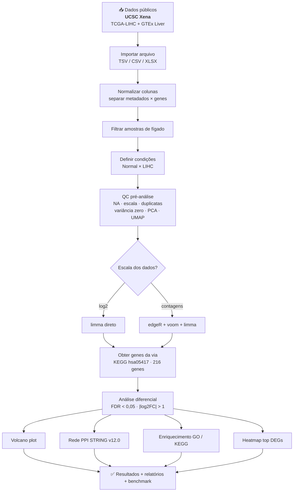
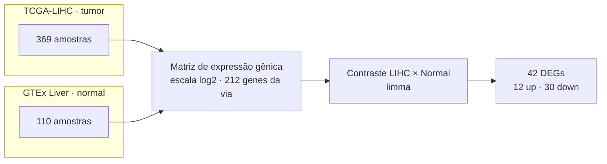
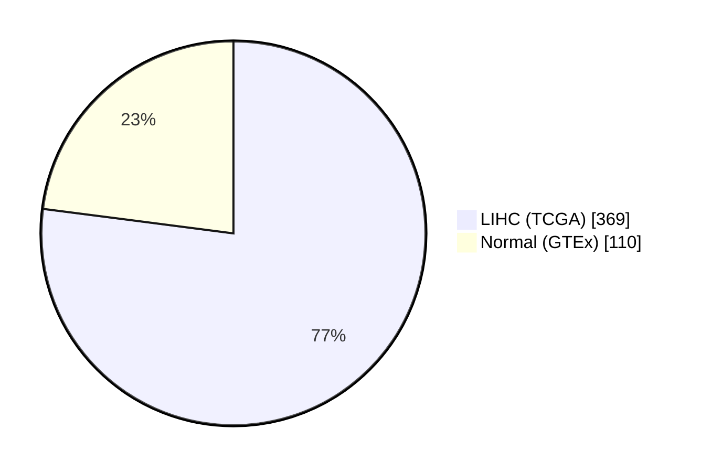
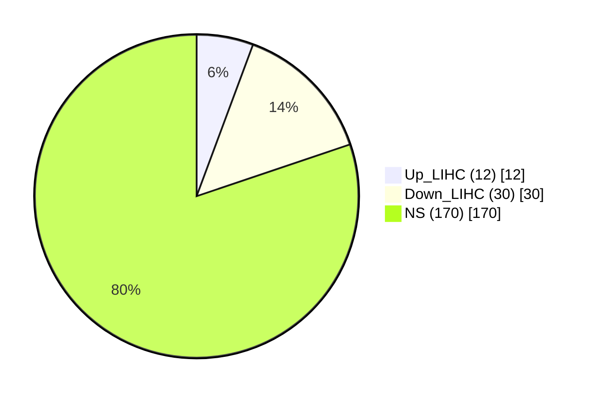
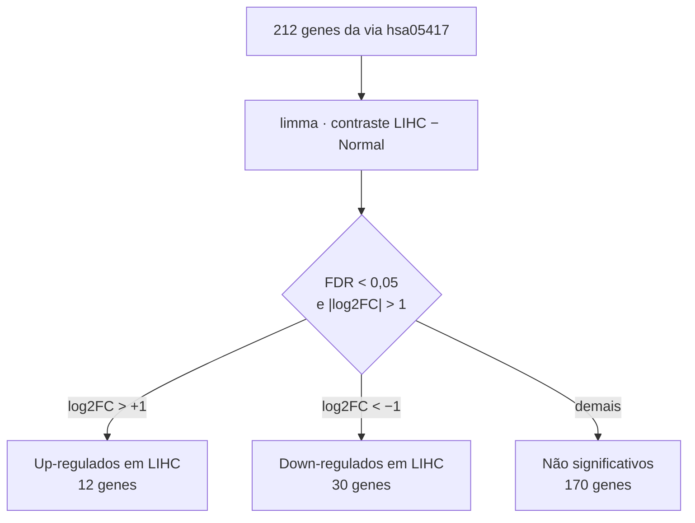
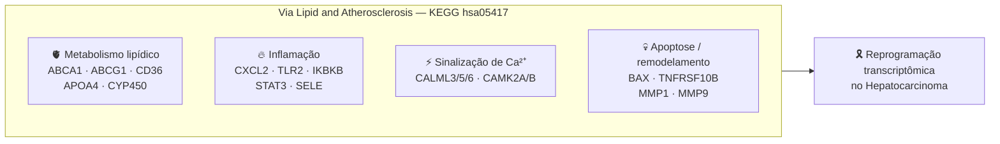

# Reprogramação Transcriptômica da Via de Lipídios e Aterosclerose no Hepatocarcinoma

Análise exploratória de **expressão diferencial** da via *Lipid and
Atherosclerosis* (KEGG `hsa05417`) entre **Hepatocarcinoma (LIHC, TCGA)** e
**fígado normal (GTEx)**, com controle de qualidade pré-análise, rede de
interação proteína-proteína (STRING), enriquecimento funcional (GO/KEGG) e
geração automática de relatórios de auditoria.

---

## Sumário

- [Visão geral](#visão-geral)
- [Fluxograma do pipeline](#fluxograma-do-pipeline)
- [Desenho do estudo](#desenho-do-estudo)
- [Resumo executivo](#resumo-executivo)
- [Estrutura do repositório](#estrutura-do-repositório)
- [Pré-requisitos](#pré-requisitos)
- [Como executar](#como-executar)
- [Resultados](#resultados)
- [Diagramas e esquemas](#diagramas-e-esquemas)
- [Documentação / auditoria](#documentação--auditoria)
- [Declaração de uso de IA](#declaração-de-uso-de-inteligência-artificial)
- [Limitações](#limitações)
- [Licença](#licença)

---

## Visão geral

| Item | Descrição |
|------|-----------|
| **Desenho** | LIHC (TCGA) *vs.* Normal (GTEx Liver) |
| **Via analisada** | KEGG `hsa05417` — Lipid and Atherosclerosis |
| **Fonte de dados** | UCSC Xena (RNA-seq, escala log2) |
| **Método de DE** | `limma` direto (dados em log2) |
| **Critérios de significância** | FDR < 0,05 e \|log2FC\| > 1 |
| **Rede PPI** | STRING v12.0 (interações físicas, score ≥ 700) |
| **Enriquecimento** | `clusterProfiler` (ORA: `enrichKEGG` + `enrichGO`) |

---

## Fluxograma do pipeline



> Versão em imagem: [`docs/diagramas/01_fluxograma_pipeline.png`](docs/diagramas/01_fluxograma_pipeline.png)

---

## Desenho do estudo



> Versão em imagem: [`docs/diagramas/02_desenho_estudo.png`](docs/diagramas/02_desenho_estudo.png)

---

## Resumo executivo

### Amostras



| Métrica | Valor |
|---------|-------|
| Amostras de fígado | **479** (LIHC: 369 · Normal: 110) |
| Genes da via KEGG `hsa05417` | 216 |
| Genes da via presentes na matriz | 212 |
| Escala dos dados | log2 (limma direto) |
| Tempo de execução | ≈ 462 s |

### Genes diferencialmente expressos (DEGs)



| Classe | Contagem |
|--------|----------|
| Up-regulados em LIHC | 12 |
| Down-regulados em LIHC | 30 |
| Não significativos (NS) | 170 |
| **Total de DEGs** | **42** |

---

## Estrutura do repositório

```
.
├── pipeline_hepato.R                 # Pipeline principal (reprodutível)
├── scripts/
│   └── análise_expressão_diferencial.R   # Versão original (legado)
├── data/
│   └── README.md                     # Instruções para obter os dados de entrada
├── docs/
│   ├── APRESENTACAO.md               # Apresentação do projeto (slides)
│   └── diagramas/                    # Fluxogramas e esquemas (Mermaid + PNG)
├── results/
│   ├── audit/                        # Relatórios, logs, benchmark e sessionInfo
│   ├── deg/                          # DEGs (CSV)
│   ├── enrichment/                   # GO BP e KEGG (CSV)
│   ├── figures/                      # Heatmap dos top DEGs (PNG)
│   ├── ppi/                          # Rede STRING e métricas topológicas
│   ├── qc/                           # PCA, UMAP e sumário de QC pré-análise
│   ├── tables/                       # Genes da via hsa05417
│   └── volcano/                      # Volcano plot da via (PNG/PDF)
├── .gitignore
└── LICENSE
```

---

## Pré-requisitos

R ≥ 4.0 e os pacotes:

```
dplyr, tidyr, tibble, stringr, ggplot2, ggrepel, limma, edgeR, igraph,
ggraph, pheatmap, scales, clusterProfiler, org.Hs.eg.db, KEGGREST,
STRINGdb, readr, readxl, rio, uwot
```

O script instala automaticamente qualquer pacote ausente. Pacotes do
Bioconductor (`limma`, `edgeR`, `clusterProfiler`, `org.Hs.eg.db`, `STRINGdb`)
são baixados pelo gerenciador do Bioconductor quando necessário.

---

## Como executar

1. **Baixe os dados** seguindo as instruções em [`data/README.md`](data/README.md)
   e salve como `data/liver_lip_aterosclerose.tsv`.

2. Execute o pipeline a partir da raiz do repositório:

   ```bash
   Rscript pipeline_hepato.R
   ```

   O script localiza a raiz do projeto automaticamente (inclusive a pasta `data/`),
   cria a estrutura `results/` e gera todos os outputs, o log
   (`results/audit/pipeline_log.csv`) e o benchmark
   (`results/audit/benchmark_pipeline.csv`).

---

## Resultados

### 1. Controle de qualidade pré-análise (QC)

Resumo em [`results/qc/qc_summary.md`](results/qc/qc_summary.md):

| Verificação | Resultado |
|-------------|-----------|
| Amostras de fígado | 479 (LIHC: 369 · Normal: 110) |
| Genes na matriz | 212 |
| Valores ausentes (NA) | 0 (0,00%) |
| Genes com variância zero | 0 |
| Genes/amostras duplicadas | 0 |
| Escala dos dados | log2 (range 0,00–21,37) |
| Efeito batch (TCGA/GTEx) | 2 estudos identificados |
| Decisão metodológica | limma direto (dados log2) |

**Figuras de QC:** [`PCA_pre_analysis.png`](results/qc/PCA_pre_analysis.png),
[`PCA_pre_analysis_batch.png`](results/qc/PCA_pre_analysis_batch.png),
[`UMAP_pre_analysis.png`](results/qc/UMAP_pre_analysis.png).

### 2. Análise de expressão diferencial (limma)

Contraste `LIHC − Normal`, com `limma` + `eBayes` (robusto) e correção de
Benjamini–Hochberg (FDR). Foram identificados **42 DEGs** na via
`hsa05417` (12 up e 30 down).

**Genes up-regulados em LIHC (12):**

| Gene | log2FC | FDR |
|------|-------:|----:|
| BAX | +1,28 | 4,5×10⁻⁴⁹ |
| HSP90AB1 | +1,12 | 7,5×10⁻⁴⁰ |
| PYCARD | +1,63 | 7,0×10⁻²² |
| PPARG | +1,07 | 2,3×10⁻²⁰ |
| MMP1 | +2,36 | 4,9×10⁻¹⁸ |
| LY96 | +1,64 | 9,3×10⁻¹⁸ |
| MMP9 | +1,91 | 4,0×10⁻¹⁴ |
| ABCG1 | +1,10 | 5,8×10⁻¹⁴ |
| CD36 | +1,34 | 6,1×10⁻¹³ |
| IKBKE | +1,12 | 1,9×10⁻¹² |
| VCAM1 | +1,37 | 6,5×10⁻¹¹ |
| PIK3R2 | +1,40 | 4,7×10⁻⁷ |

**Genes down-regulados em LIHC (30):**

| Gene | log2FC | FDR |
|------|-------:|----:|
| CALML5 | −3,08 | 3,2×10⁻⁸³ |
| MIB2 | −1,33 | 1,5×10⁻⁵⁷ |
| CXCL2 | −3,61 | 4,6×10⁻⁵⁶ |
| CALML6 | −2,82 | 1,7×10⁻⁵² |
| IKBKB | −1,08 | 5,3×10⁻⁵¹ |
| TNFRSF10B | −1,32 | 2,6×10⁻⁴⁹ |
| STAT3 | −1,11 | 4,9×10⁻³⁹ |
| ABCA1 | −1,28 | 1,3×10⁻³⁶ |
| CAMK2B | −3,69 | 4,0×10⁻³⁴ |
| PLCB2 | −1,38 | 7,7×10⁻²⁸ |
| SELE | −2,55 | 1,3×10⁻²⁷ |
| CALML3 | −2,53 | 3,9×10⁻²⁵ |
| IRF7 | −1,22 | 2,5×10⁻²² |
| FOS | −2,00 | 1,2×10⁻²¹ |
| TLR2 | −1,72 | 1,7×10⁻²¹ |
| CYP2C8 | −2,67 | 3,9×10⁻¹⁸ |
| CYP2B6 | −2,23 | 5,7×10⁻¹⁵ |
| CXCL3 | −1,58 | 1,2×10⁻¹³ |
| CYP2A7 | −3,31 | 4,4×10⁻¹³ |
| APOA4 | −3,27 | 1,0×10⁻¹² |
| CYP2C9 | −2,01 | 2,0×10⁻¹² |
| HSPA1B | −1,27 | 1,5×10⁻¹¹ |
| HSPA6 | −1,40 | 1,6×10⁻¹¹ |
| MAPK10 | −1,23 | 4,0×10⁻¹¹ |
| MAP3K5 | −1,03 | 1,0×10⁻⁹ |
| SELP | −1,18 | 5,9×10⁻⁹ |
| LBP | −1,11 | 9,0×10⁻⁷ |
| CYP2A6 | −2,17 | 1,9×10⁻⁶ |
| CAMK2A | −1,10 | 4,8×10⁻⁶ |
| CYP1A1 | −1,82 | 6,0×10⁻⁶ |

> Tabela completa (com t, P.Value, AveExpr e B): [`results/deg/DEG_significant_LA.csv`](results/deg/DEG_significant_LA.csv)
> e [`results/deg/DEG_LA_pathway_only.csv`](results/deg/DEG_LA_pathway_only.csv).

### 3. Volcano plot

O volcano plot foca exclusivamente nos **212 genes da via `hsa05417`** e rotula
os 10 genes mais significativos de cada direção.



**Figuras:**
- [`results/volcano/Volcano_LIHC_LA_pathway.png`](results/volcano/Volcano_LIHC_LA_pathway.png)
- [`results/volcano/Volcano_LIHC_LA_pathway.pdf`](results/volcano/Volcano_LIHC_LA_pathway.pdf)

**Genes rotulados no volcano** ([`Volcano_labeled_genes.csv`](results/volcano/Volcano_labeled_genes.csv)):

| Gene | log2FC | FDR | Regulação |
|------|-------:|----:|-----------|
| CALML5 | −3,08 | 3,2×10⁻⁸³ | Down |
| CXCL2 | −3,61 | 4,6×10⁻⁵⁶ | Down |
| CALML6 | −2,82 | 1,7×10⁻⁵² | Down |
| BAX | +1,28 | 4,5×10⁻⁴⁹ | Up |
| HSP90AB1 | +1,12 | 7,5×10⁻⁴⁰ | Up |
| CAMK2B | −3,69 | 4,0×10⁻³⁴ | Down |
| SELE | −2,55 | 1,3×10⁻²⁷ | Down |
| CALML3 | −2,53 | 3,9×10⁻²⁵ | Down |
| PYCARD | +1,63 | 7,0×10⁻²² | Up |
| CYP2C8 | −2,67 | 3,9×10⁻¹⁸ | Down |
| MMP1 | +2,36 | 4,9×10⁻¹⁸ | Up |
| LY96 | +1,64 | 9,3×10⁻¹⁸ | Up |
| CYP2B6 | −2,23 | 5,7×10⁻¹⁵ | Down |
| MMP9 | +1,91 | 4,0×10⁻¹⁴ | Up |
| CYP2A7 | −3,31 | 4,4×10⁻¹³ | Down |
| CD36 | +1,34 | 6,1×10⁻¹³ | Up |
| APOA4 | −3,27 | 1,0×10⁻¹² | Down |
| IKBKE | +1,12 | 1,9×10⁻¹² | Up |
| VCAM1 | +1,37 | 6,5×10⁻¹¹ | Up |
| PIK3R2 | +1,40 | 4,7×10⁻⁷ | Up |

### 4. Rede de interação proteína-proteína (PPI — STRING v12.0)

Interações físicas com score ≥ 700, construídas a partir dos 42 DEGs da via.

| Métrica | Valor |
|---------|-------|
| Genes de entrada | 42 |
| Genes mapeados no STRING | 41 |
| Interações (score ≥ 700) | 62 |
| Nós na rede | 27 |
| Arestas (após simplificação) | 31 |
| Componentes conexos | 5 |
| Maior componente | 17 nós |
| Isolados | 0 |
| **Hubs (top 20% degree)** | **6** |

**Hubs identificados:**

| Hub | Degree | Regulação |
|-----|-------:|-----------|
| HSP90AB1 | 7 | Up_LIHC |
| TLR2 | 5 | Down_LIHC |
| CALML3 | 5 | Down_LIHC |
| CALML5 | 5 | Down_LIHC |
| CALML6 | 4 | Down_LIHC |
| CAMK2A | 4 | Down_LIHC |

**Figuras e tabelas:** [`PPI_STRING_network.png`](results/ppi/PPI_STRING_network.png),
[`PPI_topology_metrics.csv`](results/ppi/PPI_topology_metrics.csv),
[`PPI_STRING_edges_score700.csv`](results/ppi/PPI_STRING_edges_score700.csv),
[`PPI_STRING_nodes_score700.csv`](results/ppi/PPI_STRING_nodes_score700.csv).

### 5. Enriquecimento funcional (GO / KEGG)

**Método:** análise de super-representação (ORA) via `clusterProfiler`
(`enrichKEGG` e `enrichGO`, ontologia BP), com universo = 212 genes testados,
`pvalueCutoff = 0.05` e `qvalueCutoff = 0.2`, separadamente para genes up e down.

**Resultado:** **nenhum termo GO/KEGG alcançou significância estatística**
após correção (FDR < 0,05). Os arquivos
[`results/enrichment/*.csv`](results/enrichment/) contêm apenas o cabeçalho.

**Interpretação:** o conjunto de DEGs é pequeno (42 genes) e o universo é
restrito (212 genes da via), o que reduz o poder estatístico da ORA. Isso não
invalida os achados de DEGs individuais — indica apenas que não houve
enriquecimento de vias *adicionais* além da própria via `hsa05417` já analisada.

### 6. GSEA / GSVA

**Status:** **não implementado na versão atual do pipeline (v3.0).**

A versão atual emprega enriquecimento por super-representação (ORA). As
abordagens de enriquecimento baseadas em *ranking* e por amostra são
complementos recomendados:

| Abordagem | O que faz | Vantagem neste estudo |
|-----------|-----------|------------------------|
| **GSEA** (`fgsea` / `gseGO` / `gseKEGG`) | Ordena **todos** os genes por estatística (logFC/t) e testa se um conjunto gênico está enriquecido nas extremidades | Mais sensível que ORA; detecta mudanças coordenadas mesmo sem muitos genes acima do limiar |
| **GSVA** (`GSVA::gsva`) | Calcula um escore de enriquecimento **por amostra** para cada conjunto gênico | Permite comparar a atividade da via entre LIHC × Normal e associá-la a variáveis clínicas |

**Recomendação:** implementar como próximo passo. O pipeline já exporta a tabela
completa ordenável em
[`results/deg/DEG_LIHC_vs_Normal_full.csv`](results/deg/DEG_LIHC_vs_Normal_full.csv),
que serve de entrada para o ranking do GSEA.

### 7. Heatmap dos top DEGs

Figura: [`results/figures/Heatmap_Top_DEGs.png`](results/figures/Heatmap_Top_DEGs.png)
(top 50 DEGs, escala por linha com clamping em ±3, clusterização ward.D2).

---

## Diagramas e esquemas

Todos os diagramas estão em [`docs/diagramas/`](docs/diagramas/) em dois formatos:

| # | Diagrama | Mermaid | PNG |
|---|----------|:-------:|:---:|
| 1 | Fluxograma do pipeline | [`.mmd`](docs/diagramas/01_fluxograma_pipeline.mmd) | [`.png`](docs/diagramas/01_fluxograma_pipeline.png) |
| 2 | Desenho do estudo | [`.mmd`](docs/diagramas/02_desenho_estudo.mmd) | [`.png`](docs/diagramas/02_desenho_estudo.png) |
| 3 | Metodologia / classificação DEG | [`.mmd`](docs/diagramas/03_metodologia_degs.mmd) | [`.png`](docs/diagramas/03_metodologia_degs.png) |
| 4 | Contexto biológico da via | [`.mmd`](docs/diagramas/04_contexto_biologico.mmd) | [`.png`](docs/diagramas/04_contexto_biologico.png) |
| 5 | Amostras (pie) | [`.mmd`](docs/diagramas/05_amostras_pie.mmd) | [`.png`](docs/diagramas/05_amostras_pie.png) |
| 6 | DEGs (pie) | [`.mmd`](docs/diagramas/06_degs_pie.mmd) | [`.png`](docs/diagramas/06_degs_pie.png) |

### Contexto biológico da via `hsa05417`



> A apresentação completa (slides) está em [`docs/APRESENTACAO.md`](docs/APRESENTACAO.md).

---

## Documentação / auditoria

Relatórios de auditoria linha a linha, reanálise e verificação do resumo expandido
estão em [`results/audit/`](results/audit/):

- `RELATORIO_FINAL_LOCK_LIHC.md` — veredito final e resultados consolidados
- `AUDITORIA_CODIGO_LINHA_A_LINHA.md` — auditoria do código
- `AUDITORIA_REANALISE_LIHC.md` — auditoria da reanálise
- `AUDITORIA_RESUMO_EXPANDIDO.md` — cruzamento do resumo com código/dados
- `pipeline_log.csv` — log passo a passo da execução
- `benchmark_pipeline.csv` / `benchmark_summary.md` — métricas de execução
- `sessionInfo.txt` — ambiente R completo

---

## Reprodução dos resultados publicados

Os outputs em `results/` foram gerados com:

- **R** 4.6.0 (Windows 11 x64) — [`results/audit/sessionInfo.txt`](results/audit/sessionInfo.txt)
- Tempo total: ≈ 462 s — [`results/audit/benchmark_summary.md`](results/audit/benchmark_summary.md)

---

## Declaração de uso de inteligência artificial

> *Portaria CNPq nº 2.664/2026* — Este trabalho contou com o uso de ferramentas
> de inteligência artificial generativa (ChatGPT-5.5, OpenAI; DeepSeek-V4-Pro,
> DeepSeek) como suporte para processamento de dados transcriptômicos, revisão
> de código em linguagem R e editoração científica, sob supervisão e validação
> integral dos autores, que assumem total responsabilidade pelo conteúdo final.

---

## Limitações

- Estudo exploratório com dados secundários (TCGA/GTEx);
- Sem validação em coorte independente;
- Sem demonstração de causalidade;
- Sem validação de biomarcadores;
- Sem alegação de aplicabilidade clínica direta.

---

## Licença

[MIT](LICENSE) © 2026 Ryan de Paulo Santos.
