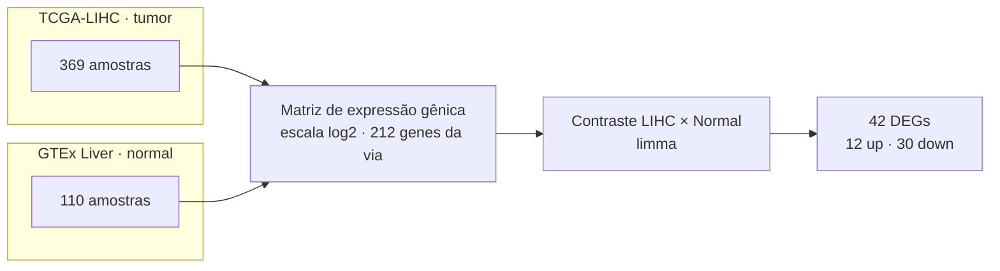
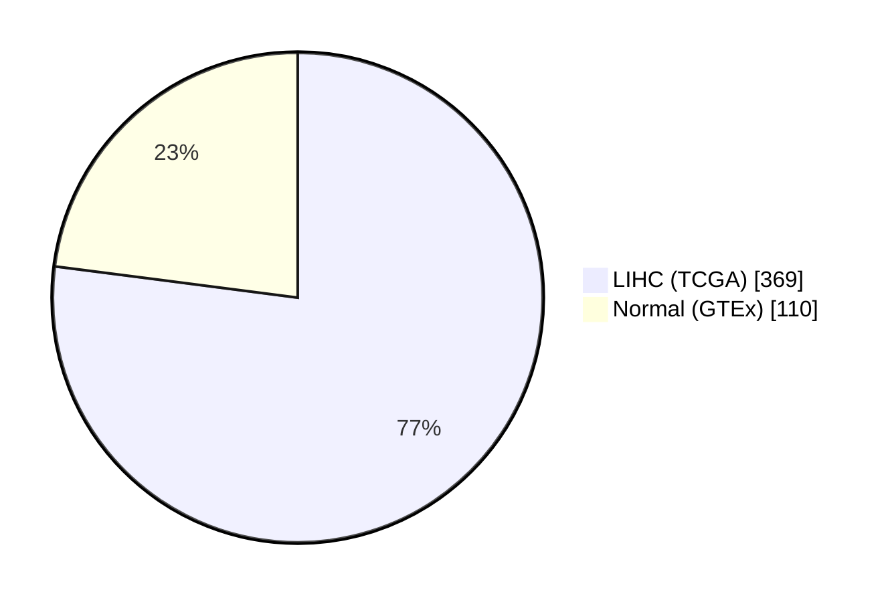
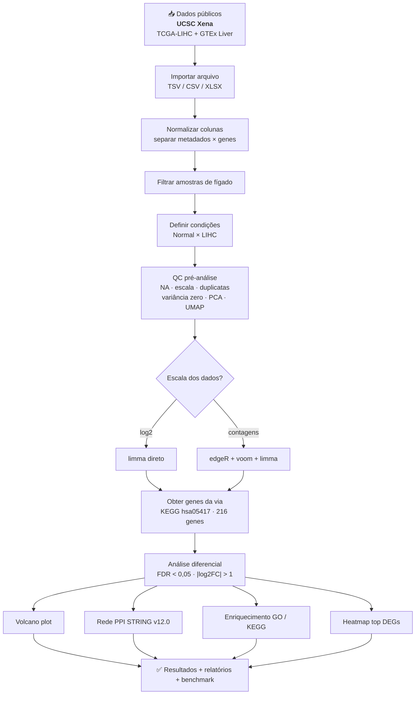
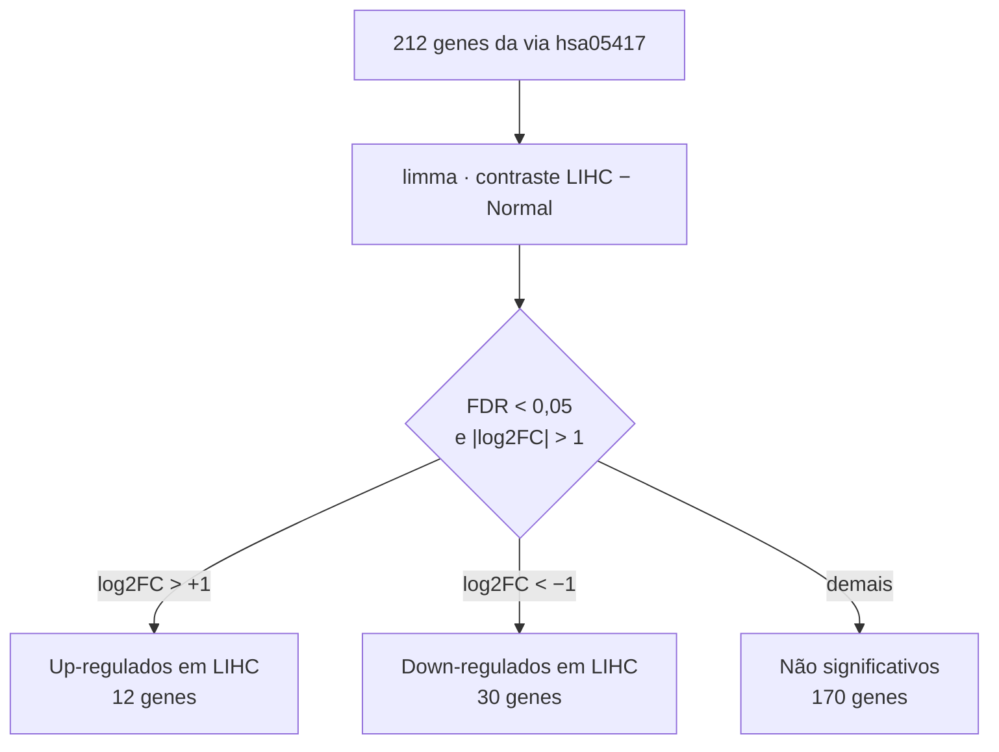
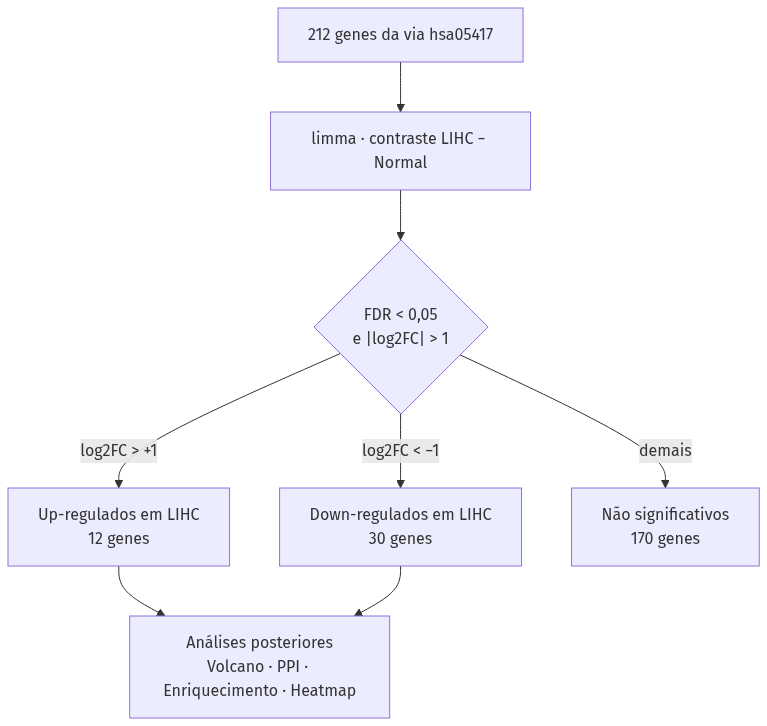
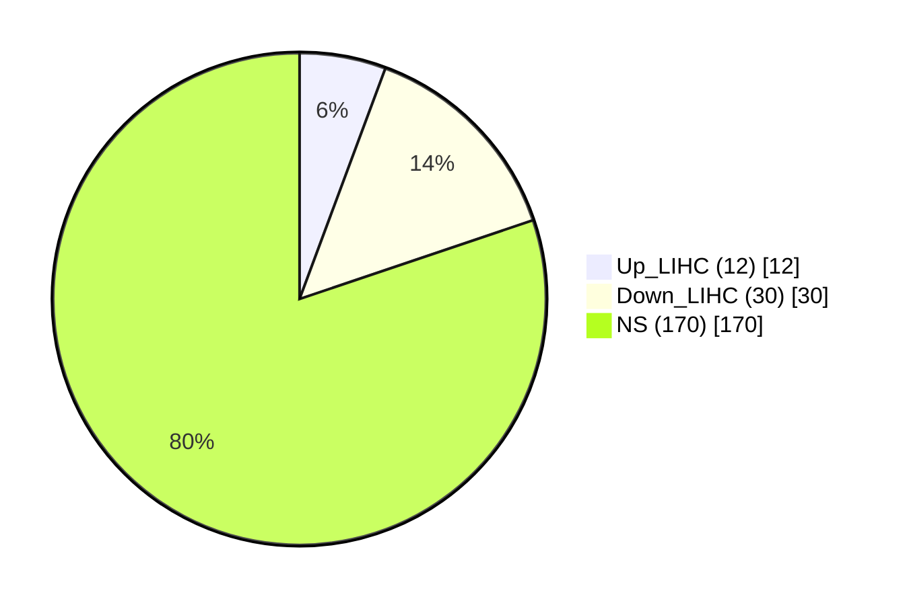
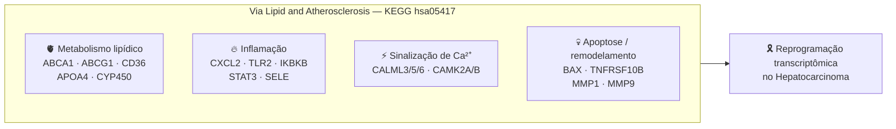

# Apresentação — Reprogramação Transcriptômica da Via de Lipídios e Aterosclerose no Hepatocarcinoma

> Roteiro de slides para apresentação do projeto. Os diagramas (Mermaid/PNG)
> estão em [`docs/diagramas/`](diagramas/).

---

## Slide 1 — Título

**Reprogramação Transcriptômica da Via de Lipídios e Aterosclerose (KEGG hsa05417) no Hepatocarcinoma**

*Análise exploratória de expressão diferencial — TCGA-LIHC vs. GTEx*

Autor: Ryan de Paulo Santos

---

## Slide 2 — Contexto e justificativa

- O **carcinoma hepatocelular (CHC/HCC)** é uma das neoplasias de maior
  relevância clínica e epidemiológica global.
- Alterações no **metabolismo lipídico** e na **inflamação crônica** estão
  implicadas na hepatocarcinogênese.
- A via **Lipid and Atherosclerosis (KEGG `hsa05417`)** integra metabolismo
  lipídico, inflamação, sinalização de cálcio e morte celular — processos
  relevantes para a progressão do CHC.

---

## Slide 3 — Objetivo

Investigar o perfil de **expressão diferencial** dos genes da via
`hsa05417` entre **HCC (LIHC)** e **fígado normal (GTEx)**, integrando:

1. Análise de expressão diferencial (limma);
2. Volcano plot;
3. Rede de interação proteína-proteína (STRING);
4. Enriquecimento funcional (GO/KEGG).

---

## Slide 4 — Desenho do estudo

---

## Slide 5 — Dados e amostras

| Fonte | n |
|-------|--|
| TCGA-LIHC (tumor) | 369 |
| GTEx Liver (normal) | 110 |
| **Total** | **479** |

---

## Slide 6 — Fluxograma do pipeline

---

## Slide 7 — Metodologia estatística

- **Método:** `limma` direto (dados em escala log2), `eBayes` robusto.
- **Critérios de significância:** FDR < 0,05 (Benjamini–Hochberg) e |log2FC| > 1.

---

## Slide 8 — Resultados: DEGs

**Top DEGs:**

| Gene | log2FC | FDR | Regulação |
|------|-------:|----:|-----------|
| CALML5 | −3,08 | 3,2×10⁻⁸³ | Down |
| CXCL2 | −3,61 | 4,6×10⁻⁵⁶ | Down |
| CALML6 | −2,82 | 1,7×10⁻⁵² | Down |
| BAX | +1,28 | 4,5×10⁻⁴⁹ | Up |
| HSP90AB1 | +1,12 | 7,5×10⁻⁴⁰ | Up |
| CAMK2B | −3,69 | 4,0×10⁻³⁴ | Down |
| MMP1 | +2,36 | 4,9×10⁻¹⁸ | Up |
| MMP9 | +1,91 | 4,0×10⁻¹⁴ | Up |

---

## Slide 9 — Resultados: Volcano plot

- Eixo x: log2 Fold Change (LIHC/Normal).
- Eixo y: −log10(FDR).
- Genes rotulados: 10 mais significativos de cada direção.

---

## Slide 10 — Resultados: Rede PPI (STRING v12.0)

| Métrica | Valor |
|---------|-------|
| Interações (score ≥ 700) | 62 |
| Nós / arestas | 27 / 31 |
| Maior componente | 17 nós |
| **Hubs** | HSP90AB1, TLR2, CALML3, CALML5, CALML6, CAMK2A |

---

## Slide 11 — Contexto biológico

---

## Slide 12 — Enriquecimento funcional e GSEA/GSVA

- **ORA (GO/KEGG):** nenhum termo significativo após FDR < 0,05 — conjunto
  pequeno (42 DEGs) e universo restrito (212 genes da via).
- **GSEA/GSVA:** não implementados na versão atual; recomendados como próximo
  passo (GSEA baseado em ranking usa todos os genes e é mais sensível).

---

## Slide 13 — Conclusões

- A via `hsa05417` mostra **reprogramação transcriptômica significativa** no CHC.
- Predomínio de genes **down-regulados** (30 de 42 DEGs), incluindo
  calmodulinas-like (CALML3/5/6), quimiocinas (CXCL2/3), CYP450 e apolipoproteínas.
- **Up-regulados** destacam-se MMP1/MMP9 (remodelamento de matriz), BAX
  (apoptose), HSP90AB1 (chaperona) e CD36 (captação lipídica).
- Rede PPI aponta **HSP90AB1** como hub central up-regulado.

---

## Slide 14 — Limitações

- Estudo exploratório com dados secundários;
- Sem validação em coorte independente;
- Sem demonstração de causalidade;
- Sem validação de biomarcadores;
- Sem alegação de aplicabilidade clínica direta.

---

## Slide 15 — Declaração de IA e agradecimentos

> *Portaria CNPq nº 2.664/2026* — uso de IA generativa (ChatGPT-5.5, OpenAI;
> DeepSeek-V4-Pro, DeepSeek) para processamento de dados transcriptômicos,
> revisão de código R e editoração científica, sob supervisão e validação
> integral dos autores.

**Obrigado!**
