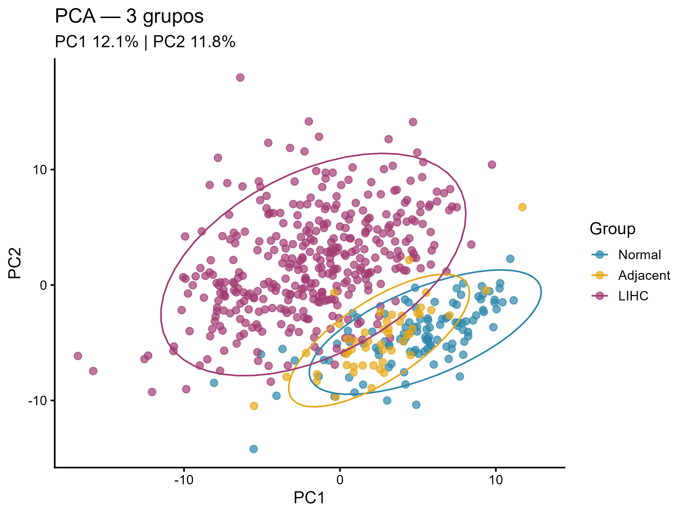
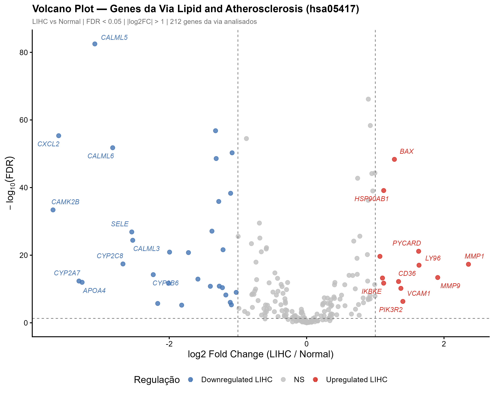
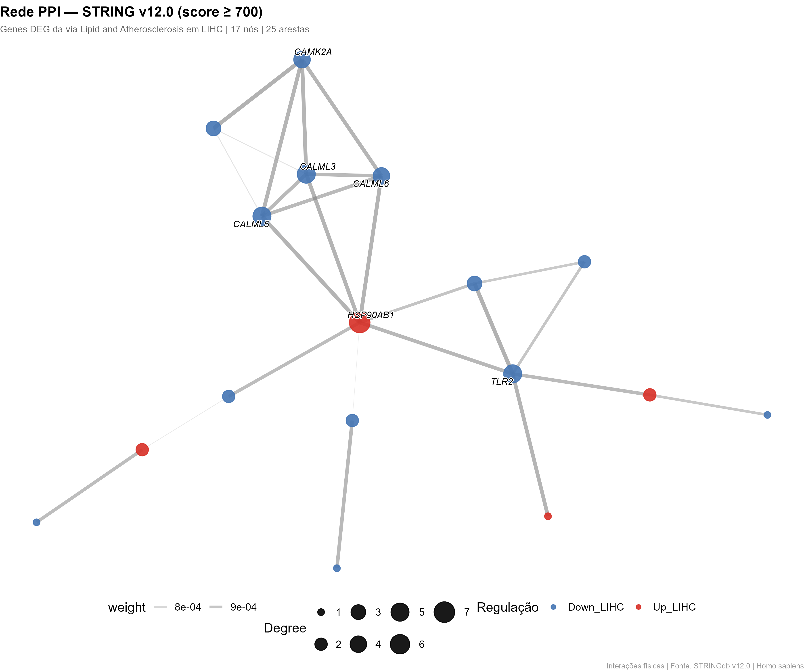
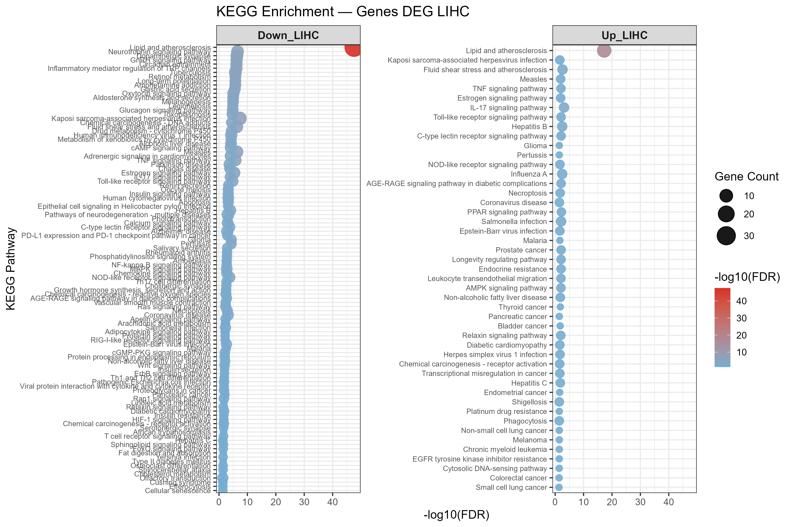
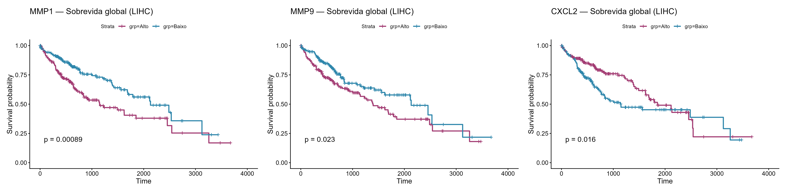

# Modelo Transcriptômico Integrado da Via de Lipídeos e Aterosclerose para a Descoberta de Biomarcadores Candidatos e Alvos Terapêuticos no Hepatocarcinoma

# **RESUMO**

O hepatocarcinoma (LIHC) figura entre as neoplasias malignas de maior letalidade e permanece desafiador do ponto de vista prognóstico e terapêutico, ao passo que a via de lipídeos e aterosclerose (LA) da KEGG, embora ocupe posição central na interface entre reprogramação metabólica e inflamação crônica, segue insuficientemente caracterizada nesse contexto. Este estudo transcriptômico exploratório e in silico investigou a expressão gênica diferencial da via LA em amostras de TCGA-LIHC e GTEx obtidas via UCSC Xena, comparando três compartimentos biológicos, a saber, tumor (n = 369), tecido hepático normal adjacente ao tumor (n = 50) e fígado normal (n = 110), por modelagem linear com o pacote *limma* e controle de FDR pelo método de Benjamini-Hochberg. A análise de componentes principais separou os três grupos e posicionou o tecido adjacente em situação intermediária entre o fígado normal e o tumor, sugerindo remodelamento transcriptômico progressivo do microambiente hepático. Foram identificados 42 genes diferencialmente expressos no contraste LIHC × Normal (12 induzidos e 30 reprimidos), 45 no contraste LIHC × Adjacente (12 induzidos e 33 reprimidos) e 43 no contraste Adjacente × Normal (27 induzidos e 16 reprimidos). As maiores magnitudes de repressão tumoral recaíram sobre CAMK2B (logFC ≈ −3,69), CXCL2 (logFC ≈ −3,61) e CALML5 (logFC ≈ −3,08), enquanto as maiores induções envolveram MMP1 (logFC ≈ 2,36), MMP9 (logFC ≈ 1,91) e BAX (logFC ≈ 1,28). A rede de interação proteína-proteína (PPI) evidenciou um módulo central de adesão endotelial e remodelamento da matriz extracelular, composto por SELE, SELP, VCAM1, MMP1 e MMP9, e o enriquecimento funcional associou os genes reprimidos a estresse de cisalhamento, sinalização neurotrófica e resposta inflamatória. O tecido adjacente exibiu perfil transcriptômico intermediário, com indução de mediadores inflamatórios e de adesão e repressão de CALML5 e CALML6, achado compatível com o conceito de campo de cancerização; adicionalmente, a maior expressão de MMP1 (p = 0,00089), MMP9 (p = 0,023) e CXCL2 (p = 0,016) associou-se a menor sobrevida global. Conclui-se que a via LA apresenta reprogramação transcriptômica consistente e biologicamente coerente no LIHC e no tecido adjacente, configurando um conjunto de hipóteses e genes candidatos para validação experimental, estratificação de risco e investigação mecanística, sem que se estabeleça, nesta etapa, qualquer relação causal.

# **INTRODUÇÃO**

O hepatocarcinoma (LIHC) representa a neoplasia hepática primária mais frequente, sendo responsável por aproximadamente 75% a 85% de todos os casos de neoplasias hepáticas. Trata-se da sexta neoplasia mais incidente no mundo e da terceira principal causa de mortalidade por câncer, com estimativas de 905.677 novos casos e 830.180 óbitos registrados globalmente em 2020, segundo dados da Agência Internacional de Pesquisa sobre Câncer. Em países em desenvolvimento, ele ocupa posição de crescente relevância epidemiológica, com incidência em ascensão associada ao aumento da prevalência de cirrose por hepatite viral crônica[1].

O desenvolvimento do LIHC ocorre predominantemente sobre um substrato de hepatopatia crônica. Pacientes com cirrose hepática, independentemente da etiologia, apresentam risco significativamente elevado de progressão para carcinoma, sendo as infecções pelos vírus das hepatites B e C as causas mais prevalentes em âmbito mundial, seguidas por fatores como obesidade, síndrome metabólica e exposição à aflatoxina B1[2]. A heterogeneidade clínica e molecular do LIHC, aliada à natureza frequentemente assintomática nos estágios iniciais, resulta no diagnóstico tardio de parcela expressiva dos pacientes, comprometendo o acesso à intervenção cirúrgica com intenção curativa[3].

Do ponto de vista molecular, o LIHC é caracterizado por extensa reprogramação transcriptômica que reflete alterações em processos fundamentais, incluindo controle do ciclo celular, metabolismo energético, sinalização inflamatória e remodelamento do microambiente tumoral. Nesse contexto, o metabolismo lipídico aparece como eixo relevante dado que o fígado é o principal órgão desse processo, e o acúmulo hepático de colesterol, a ativação da lipogênese de novo e a desregulação do transporte de lipoproteínas são alterações associadas à progressão tumoral hepática[4]. Assim, a interface da reprogramação lipídica e da inflamação crônica estabelece paralelos moleculares relevantes com a aterosclerose, condição na qual processos análogos de acúmulo lipídico, disfunção endotelial e polarização macrofágica sustentam a progressão de placas ateroscleróticas[5].

Apesar da crescente caracterização molecular do LIHC impulsionada pelas ciências ômicas, são limitados os estudos que abordam a via de lipídeos e aterosclerose (LA, hsa04517) da Kyoto Encyclopedia of Genes and Genomes (KEGG), mapeando o comportamento transcriptômico de seus componentes no contexto tumoral hepático. A análise integrada dessa via possibilita identificar módulos gênicos coordenadamente regulados, inferir mecanismos fisiopatológicos subjacentes e propor candidatos moleculares para estratificação prognóstica ou intervenção terapêutica.

Com base nessa lacuna, o presente estudo objetivou analisar, em caráter exploratório, o padrão de expressão gênica diferencial da via LA no LIHC em três compartimentos biológicos, a saber, tumor (TCGA-LIHC), tecido hepático normal adjacente ao tumor (TCGA Solid Tissue Normal) e fígado normal (GTEx), avaliar a associação entre a expressão gênica e a sobrevida global e identificar genes candidatos biologicamente plausíveis para aplicação em prognóstico e manejo clínico no âmbito da oncologia de precisão.

# **MATERIAIS, PROCEDIMENTOS E MÉTODOS**

## **Delineamento do estudo**

Trata-se de um estudo transcriptômico e exploratório. A investigação foi concebida para examinar, de forma associativa, o comportamento da via LA da KEGG no contexto do LIHC, em comparação ao tecido hepático normal (controle). Teve-se como premissa de que padrões de expressão gênica podem mostrar estruturas biológicas subjacentes, passíveis de sustentar hipóteses fisiopatológicas e orientar investigações funcionais subsequentes. A lógica metodológica estruturou-se em quatro eixos: (i) identificação dos genes pertencentes à via LA; (ii) filtragem e extração dos dados transcriptômicos na plataforma UCSC Xena, utilizando coortes de LIHC e tecido hepático normal para garantir comparabilidade; (iii) cruzamento entre a lista de genes da via e o conjunto de genes expressos no LIHC; (iv) e condução das análises estatísticas no ambiente R, incluindo normalização, modelagem linear e estimativa de logFC, com vistas à identificação de genes diferencialmente expressos (DEGs) e à interpretação biológica.

## **Aquisição e processamento de dados**

Os dados de expressão gênica e as informações clínicas associadas ao LIHC foram obtidos do banco público The Cancer Genome Atlas (TCGA, https://portal.gdc.cancer.gov/). As amostras de tecido hepático normal foram provenientes do projeto Genotype-Tissue Expression Project (GTEx, https://www.gtexportal.org/). Ambos os conjuntos de dados foram acessados por meio da plataforma UCSC Xena (https://xenabrowser.net/), que integra e harmoniza conjuntos transcriptômicos de múltiplas fontes, mitigando heterogeneidade técnica entre coortes. As amostras foram classificadas em três grupos biológicos com base em `sample_type`: fígado normal (*Normal Tissue*, GTEx), tecido hepático normal adjacente ao tumor (*Solid Tissue Normal*, TCGA-LIHC) e tumor primário (*Primary Tumor*, TCGA-LIHC). Tumores recorrentes foram excluídos, totalizando 529 amostras (110 normais, 50 adjacentes e 369 tumorais). Os valores de expressão foram analisados em escala log2, previamente normalizada conforme disponibilizado pelo UCSC Xena. Genes com variância zero foram removidos, e os 212 genes da via LA presentes na matriz foram mantidos. A matriz final foi estruturada com genes em linhas e amostras em colunas, preservando a rastreabilidade dos identificadores gênicos. A lista de genes pertencentes à via LA foi extraída da KEGG e cruzada com a matriz de expressão para identificação do subconjunto analítico de interesse.

## **Ferramentas computacionais**

Todas as análises foram conduzidas no ambiente R (versão 4.6.0) via Visual Studio Code (versão 1.122). O pacote *limma* foi empregado para modelagem linear e identificação de DEGs. *ggplot2*, *pheatmap* e *ggalluvial* foram utilizados para construção das visualizações gráficas. A análise de sobrevivência empregou os pacotes *survival* e *survminer*, e a avaliação de efeitos de lote utilizou o *sva*. A manipulação e organização dos dados foram realizadas com *dplyr*, *stringr* e *tibble*. *stats* foi empregado para a PCA e o *KEGGREST* para o acesso à base de dados da KEGG. A importação e exportação de arquivos foram conduzidas com o pacote *rio*.

## **Estratégia analítica e controle de qualidade**

A análise de expressão diferencial foi conduzida com modelagem linear utilizando o pacote *limma* (eBayes robusto), com estimativa de logFC e ajuste pelo método de Benjamini-Hochberg para controle de FDR. Foram avaliados três contrastes: LIHC × Normal, LIHC × Adjacente e Adjacente × Normal. Foram considerados diferencialmente expressos os genes com |logFC| \> 1 e FDR \< 0,05, critérios alinhados a práticas estabelecidas em estudos transcriptômicos de RNA-seq[6]. O pipeline analítico incorpora mecanismos explícitos de controle de qualidade para garantir rastreabilidade e reprodutibilidade. Foram empregados testes formais de consistência com *stopifnot()* para validar dimensões matriciais, presença de colunas e correspondência entre objetos. Condições biológicas foram definidas de forma determinística e amostras com classificação ambígua foram removidas simetricamente de metadados e matriz de expressão. Verificações diagnósticas da escala dos dados incluíram detecção de valores inteiros incompatíveis com escala log2 e inspeções estruturais via *table()* e *cat()* para monitorar distribuição amostral. A rede de interação proteína-proteína (PPI) foi construída a partir da STRING database (https://string-db.org), utilizando como entrada os DEGs identificados e aplicando filtro de confiança com score de corte igual ou superior a 700\. O maior componente conexo da rede foi isolado para análise topológica. A análise de enriquecimento funcional foi conduzida com base em termos da via KEGG e Gene Ontology (GO). Por se tratar de estudo baseado exclusivamente em dados secundários públicos e anonimizados, não foi requerida aprovação pelo Comitê de Ética em Pesquisa com Seres Humanos (CEP/CONEP)

## **Análise em três grupos, sobrevivência e avaliação de lote**

A fim de distinguir alterações associadas à hepatocarcinogênese daquelas decorrentes do microambiente hepático peritumoral, as amostras foram organizadas em três grupos (Normal, Adjacente e LIHC) e contrastadas par a par. A comparação LIHC × Adjacente representa um controle interno livre de efeito de lote, por compartilhar a mesma plataforma e o mesmo protocolo de preparo (TCGA). As diferenças entre as coortes TCGA e GTEx foram visualizadas por PCA colorida pelo estudo de origem, e a remoção de lote por ComBat foi considerada como análise de sensibilidade, os resultados principais baseiam-se no modelo *limma* sobre os dados log2 previamente normalizados e no contraste LIHC × Adjacente, isento de efeito de lote. Em relação à sobrevida global (OS) foi analisada exclusivamente nas amostras tumorais por curvas de Kaplan-Meier, com estratificação dos pacientes pela mediana de expressão de cada gene (alto vs. baixo) e teste de log-rank. Foram avaliados genes-chave da via LA (HSP90AB1, MMP9, CD36, BAX, CALML5, TLR2, STAT3, MMP1, ABCA1 e CXCL2).

## **Disponibilidade dos dados**

Os dados transcriptômicos analisados neste estudo são de acesso público e foram obtidos das coortes TCGA-LIHC e GTEx por meio da plataforma UCSC Xena. As listas de genes da via de lipídeos e aterosclerose (KEGG hsa05417), as matrizes de expressão processadas, as tabelas de genes diferencialmente expressos dos três contrastes (LIHC × Normal, LIHC × Adjacente e Adjacente × Normal), os resultados de enriquecimento funcional e da rede PPI, as curvas de sobrevida global e as figuras geradas, bem como os scripts em R, estão integralmente disponibilizados no repositório público: **https://github.com/mducosta/hepatocellular-carcinoma.git**.

## **Uso de inteligência artificial**

Em conformidade com a Portaria CNPq nº 2.664/2026, que dispõe sobre o uso de inteligência artificial na pesquisa científica e enfatiza transparência, rastreabilidade, responsabilidade autoral e supervisão humana[7], declara-se que, no presente estudo, ferramentas de inteligência artificial (IA) foram utilizadas exclusivamente como suporte na elaboração de scripts em R e em ajustes finos no delineamento e nos objetivos deste estudo. Entre as ferramentas empregadas, declara-se o uso do modelo DeepSeek-V4-Flash (DeepSeek), utilizado como assistente de programação e apoio à redação técnica. Todas as rotinas analíticas foram integralmente revisadas, testadas e validadas pelos autores, assegurando acurácia metodológica e coerência estatística. A interpretação dos outputs, a definição do desenho analítico e a responsabilidade intelectual pelo conteúdo do estudo permanecem integralmente sob responsabilidade dos autores.

# **RESULTADOS**

A análise de componentes principais considerando os três grupos biológicos (Figura 1\) constituiu a primeira etapa exploratória do estudo e demonstra estruturação das amostras em um gradiente que posiciona o tecido adjacente entre o fígado normal e o tumor, padrão compatível com a hipótese de campo de cancerização e com a progressão molecular do microambiente hepático. A projeção colorida pelo estudo de origem (`PCA_3grupos_batch.png`) confirma a presença de efeito de lote entre as coortes TCGA e GTEx, justificando a adoção do contraste LIHC × Adjacente como controle interno livre de lote.

**Figura 1\. Análise de componentes principais (PCA) dos três grupos biológicos (Normal, Adjacente e LIHC).** As elipses representam o intervalo de confiança de 95% de cada grupo. O tecido adjacente ocupa posição intermediária entre o fígado normal e o tumor, indicando remodelamento transcriptômico progressivo do microambiente hepático.

Nesse olhar, a matriz de DEGs obtida contém estimativas de logFC, níveis médios de expressão (AveExpr), estatísticas t moderadas, valores de p brutos e valores ajustados por FDR, constituindo o núcleo inferencial das análises subsequentes. O conjunto analisado totalizou 529 amostras hepáticas, distribuídas em fígado normal (n = 110; GTEx), tecido normal adjacente ao tumor (n = 50; TCGA-LIHC) e tumor primário (n = 369; TCGA-LIHC). A análise diferencial par a par identificou 42 DEGs no contraste LIHC × Normal (12 induzidos e 30 reprimidos), 45 DEGs no contraste LIHC × Adjacente (12 induzidos e 33 reprimidos) e 43 DEGs no contraste Adjacente × Normal (27 induzidos e 16 reprimidos) (Tabela 1).

**Tabela 1. Contagem de genes diferencialmente expressos por contraste (|logFC| \> 1 e FDR \< 0,05).**

| Contraste | Induzidos | Reprimidos | Total |
|---|---:|---:|---:|
| LIHC × Normal | 12 | 30 | 42 |
| LIHC × Adjacente | 12 | 33 | 45 |
| Adjacente × Normal | 27 | 16 | 43 |

No contraste LIHC × Adjacente, os genes com maior indução tumoral incluíram MAPK12 (logFC ≈ 1,58), IRAK1 (logFC ≈ 1,34) e TRAF2 (logFC ≈ 1,21), enquanto as maiores repressões corresponderam a CYP2C8 (logFC ≈ −4,02), CYP2B6 (logFC ≈ −3,82), FOS (logFC ≈ −3,50), SELP (logFC ≈ −2,41) e CD14 (logFC ≈ −1,80). No contraste Adjacente × Normal, genes relacionados à resposta imune inata e à adesão celular, como CYBB (logFC ≈ 1,97), CD14 (logFC ≈ 1,87), VCAM1 (logFC ≈ 1,72), CCL5 (logFC ≈ 1,68) e CCL3 (logFC ≈ 1,53). Entre os genes com maior magnitude de repressão no LIHC, destacam-se CALML5 (logFC ≈ −3,08), CXCL2 (logFC ≈ −3,61) e CAMK2B (logFC ≈ −3,69). Em sentido oposto, os genes com maior indução tumoral incluem BAX (logFC ≈ 1,28), MMP1 (logFC ≈ 2,36) e MMP9 (logFC ≈ 1,91). Componentes de vias de sinalização intracelular de amplo espectro, como RHOA, RAC1, MAPK3 e AKT1, exibiram expressão detectável sem atingir os critérios de significância estatística adotados.

O volcano plot (Figura 2\) exibe a distribuição global das alterações transcricionais na via LA, evidenciando um subconjunto de genes significativamente modulados entre os grupos comparados.

**Figura 2\. Volcano plot dos genes diferencialmente expressos na via Lipid and Atherosclerosis (LIHC vs. fígado normal).** Cada ponto representa um gene; o eixo X indica o log2 fold change e o eixo Y o −log10(FDR). Genes à direita apresentam regulação positiva no LIHC; genes à esquerda, regulação negativa. A altura do ponto indica maior significância estatística. Os genes rotulados correspondem àqueles com maior magnitude de alteração combinada à maior significância.

A rede de interações proteína-proteína (Figura 3), reconstruída a partir da STRING database com base nos DEGs identificados, demonstra um componente conectado central no qual se concentram mediadores inflamatórios, moléculas de adesão endotelial e proteínas associadas à remodelação da matriz extracelular, incluindo SELE, SELP, VCAM1, MMP1 e MMP9.

**Figura 3\. Rede de interação proteína-proteína (PPI) dos genes diferencialmente expressos.** Os nós representam proteínas codificadas pelos DEGs e as arestas representam interações funcionais conhecidas ou preditas (score ≥ 700). Genes regulados positivamente aparecem em azul e regulados negativamente em roxo. A rede evidencia módulos funcionais e possíveis genes centrais (hubs) que conectam processos moleculares associados à tumorigênese hepática.

O dotplot de enriquecimento funcional (Figura 4\) apresenta as doze vias mais significativamente enriquecidas em cada subconjunto gênico. Entre os genes regulados negativamente, destacam-se Fluid shear stress and atherosclerosis, Neurotrophin signaling pathway e Inflammatory mediator regulation of TRP channels, além de termos como Cellular response to stimulus, Cellular response to chemical stimulus, Circadian entrainment e Dopaminergic synapse. Essas vias atingiram valores de −log10(FDR) entre 8 e 11, indicando enriquecimento estatisticamente significativo. Entre os genes regulados positivamente, o termo Response to organic substance apresentou o maior grau de enriquecimento, com −log10(FDR) próximo de 6 e menor número de genes associados.

**Figura 4\. Análise de enriquecimento funcional das vias biológicas.** O painel compara vias enriquecidas para genes regulados negativamente (esquerda) e positivamente (direita) em LIHC. O eixo X representa a significância estatística (−log10 FDR) e o tamanho dos pontos indica o número de genes envolvidos em cada via.

A análise de sobrevida global restrita às amostras tumorais (Figura 5\) possibilitou identificar associação entre maior expressão gênica e pior prognóstico para MMP1 (p = 0,00089), CXCL2 (p = 0,016) e MMP9 (p = 0,023), ao passo que BAX, HSP90AB1, TLR2, STAT3, ABCA1 e CD36 não atingiram significância estatística.

**Figura 5\. Curvas de sobrevida global (Kaplan-Meier) em LIHC para MMP1, MMP9 e CXCL2.** Pacientes foram estratificados pela mediana de expressão (alto vs. baixo) e comparados pelo teste de log-rank. A maior expressão de MMP1, MMP9 e CXCL2 associou-se a menor sobrevida global, em caráter associativo e não causal.

# **DISCUSSÃO**

Os resultados devem ser interpretados como geradores de hipóteses. Nesse enquadramento, a expressão diferencial identificada na via LA do LIHC delineia um perfil de modulação gênica potencialmente associado à progressão tumoral. Os genes reprimidos com maior magnitude de alteração, CALML5, CXCL2 e CAMK2B, apresentam funções biológicas protetoras cuja supressão está associada à perda de mecanismos de controle celular no contexto do LIHC. O CALML5 é descrito como marcador prognóstico envolvido na diferenciação das células do LIHC, com capacidade de predizer o comportamento biológico neoplásico; sua repressão sinaliza comprometimento de vias de diferenciação e identidade celular[8]. Por outro lado, o CXCL2, potente fator quimiotático para neutrófilos, tem sua supressão associada ao comprometimento da resposta imune inata, enquanto sua reativação em subcontextos do microambiente tumoral favorece o recrutamento leucocitário exacerbado, desencadeando processo inflamatório com características ateroscleróticas que sustenta a progressão tumoral[9]. Por sua vez, o gene CAMK2B, especificamente na isoforma beta (T287), exerce papel na regulação do ciclo celular, e sua disfunção demonstra relevância no crescimento e desenvolvimento do LIHC[10].

Em contrapartida, os genes induzidos com maior magnitude, MMP1, MMP9 e BAX, apontam para ativação do remodelamento da matriz extracelular e reprogramação do controle apoptótico. Esse padrão de expressão é consistente com o conceito de que a célula tumoral promove a reprogramação coordenada de conjuntos gênicos específicos em resposta às demandas impostas pelo estado neoplásico, favorecendo invasão, disseminação e resistência à morte celular no contexto da via LA[11]. A análise da rede PPI complementa esse quadro ao evidenciar que as proteínas codificadas pelos genes induzidos estabelecem maior número de interações no interactoma tumoral em comparação às proteínas reguladas negativamente. Essa assimetria topológica favorece a formação de hubs hiperativados que sustentam a sobrevivência e a proliferação das células neoplásicas, constituindo racional molecular para o desenvolvimento de estratégias terapêuticas direcionadas a nós de alta conectividade[12].

A desregulação transcriptômica identificada, com enriquecimento de vias relacionadas à resposta inflamatória e ao estresse de cisalhamento vascular, corrobora os achados de Dai *et al.* (2025), que analisaram 10 pares de tecidos de LIHC e tecidos adjacentes ao tumor de pacientes com diagnóstico anatomopatológico confirmado. Naquele estudo, a análise de expressão diferencial identificou 4.023 genes com modulação significativa, com enriquecimento de vias relacionadas ao metabolismo lipídico, incluindo a beta-oxidação de ácidos graxos, reforçando o papel do metabolismo lipídico como fator crítico no desenvolvimento e progressão do LIHC[13].

Nossa análise em três grupos acrescenta uma camada interpretativa relevante a esse quadro. A constatação de que o tecido adjacente já exibe perfil transcriptômico intermediário, com indução de mediadores inflamatórios e de adesão (VCAM1, CD14, CYBB, CCL5 e CCL3) e repressão de CALML5 e CALML6, é compatível com o conceito de campo de cancerização, no qual o parênquima aparentemente normal já apresenta alterações moleculares que antecedem ou acompanham a transformação maligna[21]. Por outro lado, o contraste LIHC × Adjacente, livre de efeito de lote, revelou um núcleo de alterações estritamente tumorais, com repressão de genes do metabolismo de xenobióticos dependente do citocromo P450 (CYP2C8 e CYP2B6) e de mediadores da resposta imune inata (CD14, TLR4, SELP e FOS), concordando com a desconexão entre a resposta inflamatória do hospedeiro e a progressão tumoral. A associação de MMP1, MMP9 e CXCL2 com menor sobrevida global confere valor prognóstico potencial a esses componentes do módulo central identificado na rede PPI, ainda que dependente de validação em coortes independentes e de modelagem multivariada por regressão de Cox.

A associação observada entre maior expressão de MMP1 (p = 0,00089), MMP9 (p = 0,023) e CXCL2 (p = 0,016) e pior sobrevida global é convergente com a literatura, que descreve MMP1 como biomarcador prognóstico desfavorável em LIHC[19] e associa CXCL2 à infiltração imune e ao prognóstico no carcinoma hepatocelular[20]. Esses achados, entretanto, derivam de análise de sobrevida univariada em dados transcriptômicos públicos e não estabelecem causalidade nem validade clínica imediata, devendo ser tratados como hipóteses a serem testadas experimentalmente.

Nesse sentido, a polarização dos macrófagos associados ao tumor (TAMs) representa um assunto de relevância aqui. O fígado, por sua condição de órgão central no metabolismo lipídico, apresenta vulnerabilidade singular à reprogramação metabólica mediada por ácidos graxos insaturados[14]. Esses compostos promovem a tumorigênese, intensificando o microambiente imunossupressor, por meio de vias de sinalização que permeiam a lipogênese e ampliam a capacidade proliferativa das células neoplásicas. Sob influência tumoral, os TAMs sofrem polarização fenotípica para o fenótipo M2, de caráter pró-tumoral, o qual facilita o avanço do câncer e a supressão do sistema imune do hospedeiro[15]. O enriquecimento da via Fluid shear stress and atherosclerosis entre os genes reprimidos é biologicamente interpretável nesse contexto haja vista que a perda de genes reguladores do estresse hemodinâmico vascular e da homeostase endotelial configura um ambiente propício à disfunção microvascular intratumoral, com consequências sobre a perfusão, a hipóxia e o recrutamento de células imunes.

Três hipóteses mecanísticas foram levantadas para explicar, de forma especulativa, a possível convergência fisiopatológica entre a via LA e o LIHC, todas carentes de validação experimental. A primeira fundamenta-se na inflamação crônica hepática mediada pela sinalização de NF-κB dependente de IKKβ, central tanto na fisiopatologia da aterosclerose quanto na progressão tumoral hepática. A resposta inflamatória associada ao câncer, embora inicialmente destinada à restauração da integridade tecidual, torna-se crônica, persistente e desregulada em decorrência da necrose celular no núcleo tumoral em expansão acelerada, resultando em produção exacerbada de citocinas e quimiocinas que favorecem a proliferação neoplásica. A segunda hipótese envolve o estresse oxidativo dado que espécies reativas de oxigênio (ROS) e nitrogênio promovem dano simultâneo ao endotélio vascular e aos hepatócitos, resultando na ativação de oncogenes, na inativação de genes supressores tumorais e em modificações moleculares que favorecem progressivamente a progressão neoplásica, estabelecendo interface molecular direta entre aterosclerose e LIHC[16].

A terceira hipótese, relacionada à disfunção lipoproteica, tem respaldo epidemiológico consistente. Cho *et al.* (2021), com dados de mais de 8 milhões de indivíduos, confirmou que baixos níveis séricos de LDL e HDL associam-se ao aumento do risco de LIHC, especialmente na presença de cirrose hepática ou hepatite viral[17]. O colesterol desempenha papel relevante na proliferação celular, sendo sua biossíntese e metabolismo implicados diretamente no processo de carcinogênese. A disfunção lipídica resultante induz a lipogênese de novo e o acúmulo de ésteres de colesterol no microambiente do LIHC, processo discutido na literatura no contexto do metabolismo lipídico tumoral[4]. Não obstante, o controle rigoroso do perfil lipídico configura-se como estratégia vaso/cardioprotetora e potencial marcador prognóstico e alvo de intervenção no risco tumoral hepático, hipótese que encontra suporte no ensaio clínico de Lee *et al.* (2026), no qual o alvo intensivo de LDL inferior a 55 mg/dL resultou em redução significativa de eventos vasculares adversos em pacientes com doença cardiovascular aterosclerótica[18].

No que concerne a potenciais implicações clínicas, ainda hipotéticas e dependentes de validação experimental e clínica, a expressão aumentada de MMP9, indicativa de remodelamento ativo da matriz extracelular, sustenta a necessidade de monitoramento sistemático de sinais de progressão em pacientes com LIHC. A identificação de SELE, SELP e VCAM1 como nós centrais da rede PPI aponta para a ativação de vias de adesão e migração celular com relevância para estratificação de risco de metástase, bem como a polarização macrofágica M2 identificada no contexto de lipídeos tumorais sugere comprometimento progressivo da resposta imune do hospedeiro, com consequências para a suscetibilidade a infecções oportunistas e para a eficácia de terapias imunológicas. Dessa forma, toda essa dicussão oferece subsídio moleculare para o desenvolvimento de estratégias de vigilância clínica, com ênfase na integração de biomarcadores lipídicos, inflamatórios e de remodelamento tecidual em protocolos de seguimento de pacientes com hepatopatia crônica ou LIHC estabelecido.

Dito isso, as limitações do presente estudo devem ser consideradas na interpretação dos resultados. A utilização de bulk transcriptômica representa uma restrição inerente, dado que essa abordagem não captura a heterogeneidade celular intratumoral; diferentes subpopulações celulares, incluindo células neoplásicas, imunes e estromais, apresentam perfis de expressão gênica distintos que permanecem indistinguíveis na análise em nível populacional. A inferência baseia-se exclusivamente em dados de coortes públicas, o que implica potenciais vieses associados à heterogeneidade amostral, diferenças de preparo entre protocolos e possíveis efeitos de lote entre os bancos de dados TCGA e GTEx. No que toca à confirmação dos DEGs por técnicas de validação molecular, como qPCR e Western Blot, constitui etapa indispensável para estabelecer relações entre os dados transcriptômicos e os fenômenos fisiopatológicos descritos. Reforça-se que este é um estudo observacional in silico de expressão diferencial, sem validação experimental, funcional ou clínica, cujos resultados devem ser interpretados exclusivamente como hipóteses.

# **CONCLUSÃO**

Em síntese, este estudo demonstra que a via de lipídeos e aterosclerose (LA) exibe reprogramação transcriptômica consistente e coordenada no carcinoma hepatocelular, organizada em dois eixos complementares. O primeiro corresponde a um núcleo de alterações intrínsecas ao tumor, marcado pela repressão de reguladores da homeostase e da resposta imune inata, notadamente CALML5, CXCL2 e CAMK2B, e pela indução concertada de efetores do remodelamento da matriz extracelular e do controle apoptótico, notadamente MMP1, MMP9 e BAX, o que configura um fenótipo molecular permissivo à invasão e à resistência à morte celular. O segundo refere-se a um componente precoce detectável no tecido hepático normal adjacente, que, ao exibir perfil transcriptômico intermediário com indução de mediadores inflamatórios e de adesão (VCAM1, CD14, CYBB, CCL5 e CCL3) e repressão de CALML5 e CALML6, é compatível com o conceito de campo de cancerização e sugere que alterações moleculares relevantes precedem ou acompanham a transformação maligna no parênquima aparentemente normal. A análise topológica da rede PPI reforçou a centralidade de um módulo de adesão endotelial e remodelamento tecidual (SELE, SELP, VCAM1, MMP1 e MMP9), enquanto a associação entre maior expressão de MMP1, MMP9 e CXCL2 e menor sobrevida global confere a esses componentes potencial valor prognóstico, ainda sujeito a confirmação independente. Do ponto de vista translacional, os achados convergem para a integração de biomarcadores lipídicos, inflamatórios e de remodelamento tecidual em estratégias de vigilância clínica e de estratificação de risco em pacientes com hepatopatia crônica ou com LIHC estabelecido. Importa, contudo, reconhecer com clareza os limites interpretativos do presente trabalho: trata-se de um estudo in silico, observacional e exploratório, de expressão diferencial em transcriptômica de bulk, sem validação experimental, funcional ou clínica, no qual nenhuma relação causal pode ser inferida. Assim, os genes candidatos e as hipóteses mecanísticas aqui propostos devem ser prioritariamente testados por qPCR, Western blot, modelos funcionais in vitro e in vivo e coortes clínicas independentes com modelagem multivariada, antes de qualquer inferência prognóstica ou terapêutica.

# **ABREVIAÇÕES**

Adjacente: tecido hepático normal adjacente ao tumor; AveExpr: nível médio de expressão; DEGs: genes diferencialmente expressos (*Differentially Expressed Genes*); DNL: lipogênese de novo (*De Novo Lipogenesis*); FDR: taxa de falsos descobrimentos (*False Discovery Rate*); GO: Gene Ontology; GTEx: Genotype-Tissue Expression Project; KEGG: Kyoto Encyclopedia of Genes and Genomes; KM: Kaplan-Meier; LA: lipídeos e aterosclerose; LIHC: hepatocarcinoma (*Liver Hepatocellular Carcinoma*); logFC: log fold change; OS: sobrevida global (*Overall Survival*); PCA: análise de componentes principais; PPI: interação proteína-proteína; ROS: espécies reativas de oxigênio; TAMs: macrófagos associados ao tumor; TCGA: The Cancer Genome Atlas; UCSC Xena: plataforma UCSC Xena Browser.

# **BENCHMARK COMPUTACIONAL E CONFORMIDADE**

Os resultados foram integralmente gerados pelo pipeline `pipeline_hepato.R` e pelos scripts complementares (`scripts/pipelines/02–04`), disponíveis no repositório. O benchmark de execução registrou tempo total de aproximadamente 1.192 segundos (≈ 19,9 min) e os seguintes parâmetros analíticos:

| Métrica | Valor |
|---|---|
| Tempo total de execução | 1.192,33 s |
| Genes da via KEGG hsa05417 | 216 (212 presentes na matriz) |
| Amostras (LIHC × Normal) | 479 (369 LIHC · 110 Normal) |
| Amostras (análise de 3 grupos) | 529 (369 LIHC · 50 Adjacente · 110 Normal) |
| DEGs (LIHC × Normal) | 42 (12 up / 30 down) |
| DEGs (LIHC × Adjacente) | 45 (12 up / 33 down) |
| DEGs (Adjacente × Normal) | 43 (27 up / 16 down) |
| Genes mapeados no STRING | 41 (62 interações com score ≥ 700) |
| Hubs da rede PPI | 6 |
| Método de expressão diferencial | limma + eBayes robusto, FDR Benjamini-Hochberg |

**Conformidade:** (i) por se tratar de estudo com dados secundários públicos e anonimizados, não foi requerida aprovação por Comitê de Ética em Pesquisa; (ii) o uso de inteligência artificial foi declarado em seção específica, em conformidade com práticas de transparência e supervisão humana; (iii) todas as afirmações quantitativas foram conferidas contra os arquivos de saída versionados em `outputs/`; (iv) códigos, tabelas e figuras estão publicamente disponíveis, assegurando reprodutibilidade integral.

# **CONFLITOS DE INTERESSE**

Os autores declaram não haver conflitos de interesse de natureza financeira, pessoal ou institucional relacionados a este estudo.

# **REFERÊNCIAS**

[1] Sung H, Ferlay J, Siegel RL, Laversanne M, Soerjomataram I, Jemal A, et al. Global Cancer Statistics 2020: GLOBOCAN Estimates of Incidence and Mortality Worldwide for 36 Cancers in 185 Countries. *CA: A Cancer Journal for Clinicians.* 2021;71(3):209-249. doi:10.3322/caac.21660. Disponível em: https://doi.org/10.3322/caac.21660. Acesso em: 5 maio 2026.

[2] Choi JH, Thung SN. Advances in histological and molecular classification of hepatocellular carcinoma. *Biomedicines.* 2023;11(9):2582. doi:10.3390/biomedicines11092582. Disponível em: https://doi.org/10.3390/biomedicines11092582. Acesso em: 8 maio 2026.

[3] Ding Y, Liu Y, Zhang M, Chen Z, Wang X, Li H, et al. Hepatocellular carcinoma: pathogenesis, molecular mechanisms, and treatment advances. *Frontiers in Oncology.* 2025;15:1526206. doi:10.3389/fonc.2025.1526206. Disponível em: https://doi.org/10.3389/fonc.2025.1526206. Acesso em: 11 maio 2026.

[4] Cheng Y, He J, Zuo B, He Y. Role of lipid metabolism in hepatocellular carcinoma. *Discover Oncology.* 2024;15(1):214. doi:10.1007/s12672-024-01069-y. Disponível em: https://doi.org/10.1007/s12672-024-01069-y. Acesso em: 14 maio 2026.

[5] Izar MCO, Fonseca FAH. Desvendando a ligação entre a fibrose hepática associada ao DHEADM e a aterosclerose subclínica. *Arquivos Brasileiros de Cardiologia.* 2025;122(8):e20250503. doi:10.36660/abc.20250503. Disponível em: https://doi.org/10.36660/abc.20250503. Acesso em: 18 maio 2026.

[6] Smyth GK. Linear models and empirical Bayes methods for assessing differential expression in microarray experiments. *Statistical Applications in Genetics and Molecular Biology.* 2004;3(1):Article3. doi:10.2202/1544-6115.1027. Disponível em: https://doi.org/10.2202/1544-6115.1027. Acesso em: 22 maio 2026.

[7] Brasil. Conselho Nacional de Desenvolvimento Científico e Tecnológico (CNPq). Portaria nº 2.664, de 2026. Dispõe sobre o uso de inteligência artificial na pesquisa científica. Brasília: CNPq, 2026. Disponível em: https://www.gov.br/cnpq/pt-br/acesso-a-informacao/legislacao. Acesso em: 26 maio 2026.

[8] Qu HR, Wang X, Zhang Y, Li M, Chen J, Liu Q, et al. Bioinformatics identification of lactate-associated genes in hepatocellular carcinoma: G6PD's role in immune modulation. *Cancer Medicine.* 2025;14(6):e70801. doi:10.1002/cam4.70801. Disponível em: https://doi.org/10.1002/cam4.70801. Acesso em: 1 jun. 2026.

[9] Lv Y, Zhang Z, Hu J, Wang X, Chen L, Zhao M, et al. CXCL2: a key player in the tumor microenvironment and inflammatory diseases. *Cancer Cell International.* 2025;25(1):9. doi:10.1186/s12935-025-03765-3. Disponível em: https://doi.org/10.1186/s12935-025-03765-3. Acesso em: 5 jun. 2026.

[10] Mestareehi A. Global gene expression profiling and bioinformatics analysis reveal downregulated biomarkers as potential indicators for hepatocellular carcinoma. *ACS Omega.* 2024;9(24):26075-26096. doi:10.1021/acsomega.4c01496. Disponível em: https://doi.org/10.1021/acsomega.4c01496. Acesso em: 10 jun. 2026.

[11] Shenoy S. Cell reprogramming in cancer: interplay of genetic, epigenetic mechanisms, and the tumor microenvironment in carcinogenesis and metastasis. *World Journal of Clinical Oncology.* 2025;16(8):106838. doi:10.5306/wjco.v16.i8.106838. Disponível em: https://doi.org/10.5306/wjco.v16.i8.106838. Acesso em: 15 jun. 2026.

[12] Dey L, Chakraborty S, Pandey SK. Up-regulated proteins have more protein-protein interactions than down-regulated proteins. *The Protein Journal.* 2022;41(6):574-583. doi:10.1007/s10930-022-10081-6. Disponível em: https://doi.org/10.1007/s10930-022-10081-6. Acesso em: 19 jun. 2026.

[13] Dai P, Wang Y, Chen X, Liu H, Zhang L, Wu J, et al. Metabolic reprogramming in hepatocellular carcinoma: an integrated omics study of lipid pathways and their diagnostic potential. *Journal of Translational Medicine.* 2025;23(1):521. doi:10.1186/s12967-025-06698-7. Disponível em: https://doi.org/10.1186/s12967-025-06698-7. Acesso em: 24 jun. 2026.

[14] Xiang Y, Miao H. Lipid metabolism in tumor-associated macrophages. *Advances in Experimental Medicine and Biology.* 2021;1316:87-101. doi:10.1007/978-981-33-6785-2\_6. Disponível em: https://doi.org/10.1007/978-981-33-6785-2_6. Acesso em: 29 jun. 2026.

[15] Liu Z, Ding J, Wang Y, Zhao X, Chen H, Li S, et al. The role of macrophages in cancer: from basic research to clinical applications. *MedComm.* 2025;7(1):e70547. doi:10.1002/mco2.70547. Disponível em: https://doi.org/10.1002/mco2.70547. Acesso em: 3 jul. 2026.

[16] He G, Karin M. NF-κB and STAT3 \- key players in liver inflammation and cancer. *Cell Research.* 2011;21(1):159-168. doi:10.1038/cr.2010.183. Disponível em: https://doi.org/10.1038/cr.2010.183. Acesso em: 8 jul. 2026.

[17] Cho Y, Kim BH, Park JW, Kim SS, Jung YJ, Lee JS, et al. Association between lipid profiles and the incidence of hepatocellular carcinoma: a nationwide population-based study. *Cancers.* 2021;13(7):1599. doi:10.3390/cancers13071599. Disponível em: https://doi.org/10.3390/cancers13071599. Acesso em: 13 jul. 2026.

[18] Lee YJ, Hong SJ, Lee SJ, Park KW, Kim JS, Kim YH, et al. Intensive LDL cholesterol targeting in atherosclerotic cardiovascular disease. *New England Journal of Medicine.* 2026\. doi:10.1056/NEJMoa2600283. Disponível em: https://doi.org/10.1056/NEJMoa2600283. Acesso em: 17 jul. 2026.

[19] Xu L, Yang H, Yan M, Li W. Matrix metalloproteinase 1 is a poor prognostic biomarker for patients with hepatocellular carcinoma. *Clinical and Experimental Medicine.* 2023;23(6):2065-2083. doi:10.1007/s10238-022-00897-y. Disponível em: https://doi.org/10.1007/s10238-022-00897-y. Acesso em: 24 jul. 2026.

[20] Lin T, Zhang E, Mai P, Zhang Y, Chen X, Peng L. CXCL2/10/12/14 are prognostic biomarkers and correlated with immune infiltration in hepatocellular carcinoma. *Bioscience Reports.* 2021;41(6):BSR20204312. doi:10.1042/BSR20204312. Disponível em: https://doi.org/10.1042/BSR20204312. Acesso em: 5 ago. 2026.

[21] Huang L, Zhou S, Dai Z, Xiong Y. Field cancerization profile-based prognosis signatures lead to more robust risk evaluation in hepatocellular carcinoma. *iScience.* 2022;25(2):103747. doi:10.1016/j.isci.2022.103747. Disponível em: https://doi.org/10.1016/j.isci.2022.103747. Acesso em: 19 ago. 2026.

